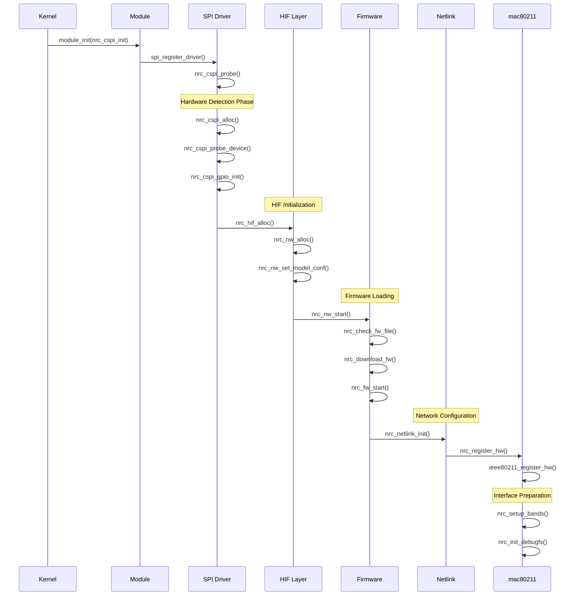

# NRC7292 Driver Initialization Sequence Analysis

## Overview

The NRC7292 HaLow driver initialization sequence is a complex multi-stage process that systematically progresses from kernel module loading to network interface preparation. This document provides detailed analysis of each initialization stage based on actual source code examination.

## Major Initialization Stages

### 1. Module Loading Sequence

#### 1.1 Kernel Module Entry Point
```c
// nrc-hif-cspi.c
static int __init nrc_cspi_init(void)
{
    // Register SPI driver
    ret = spi_register_driver(&nrc_cspi_driver);
    if (ret) {
        pr_info("Failed to register spi driver(%s).", 
                nrc_cspi_driver.driver.name);
        return ret;
    }
    
    return 0;
}

module_init(nrc_cspi_init);
```

#### 1.2 Module Parameter Initialization
The driver initializes the following key module parameters:

- **Firmware Configuration**: `fw_name`, `bd_name`
- **Hardware Interface**: `hifspeed`, `spi_bus_num`, `spi_cs_num`
- **GPIO Configuration**: `spi_gpio_irq`, `power_save_gpio`
- **Network Parameters**: `ampdu_mode`, `power_save`, `bss_max_idle`

### 2. Hardware Detection and Initialization

#### 2.1 SPI Device Probe
```c
// nrc-hif-cspi.c
static int nrc_cspi_probe(struct spi_device *spi)
{
    struct nrc_spi_priv *priv;
    struct nrc_hif_device *hdev;
    struct nrc *nw;
    
    // 1. SPI device initialization
    priv = nrc_cspi_alloc(spi);
    if (!priv) {
        dev_err(&spi->dev, "Failed to nrc_cspi_alloc\n");
        return -ENOMEM;
    }
    
    // 2. Hardware ID verification
    ret = nrc_cspi_probe_device(priv);
    if (ret) {
        dev_err(&spi->dev, "Failed to nrc_cspi_probe_device\n");
        goto err_cspi_free;
    }
    
    // 3. GPIO initialization
    ret = nrc_cspi_gpio_init(spi);
    if (ret) {
        dev_err(&spi->dev, "Failed to nrc_cspi_gpio_init\n");
        goto err_cspi_free;
    }
    
    // 4. HIF device initialization
    hdev = nrc_hif_alloc(&spi->dev, priv);
    if (!hdev) {
        dev_err(&spi->dev, "Failed to nrc_hif_alloc\n");
        goto err_gpio_free;
    }
    
    // 5. NRC network context allocation
    nw = nrc_nw_alloc(&spi->dev, hdev);
    if (IS_ERR(nw)) {
        dev_err(&spi->dev, "Failed to nrc_nw_alloc\n");
        goto err_hif_free;
    }
    
    // 6. Chip ID based model configuration
    nrc_nw_set_model_conf(nw, priv->hw.sys.chip_id);
    
    // 7. Network stack startup
    ret = nrc_nw_start(nw);
    if (ret) {
        dev_err(&spi->dev, "Failed to nrc_nw_start (%d)\n", ret);
        goto err_nw_free;
    }
    
    return 0;
}
```

#### 2.2 Hardware ID Verification Process
```c
// nrc-hif-cspi.c
static int nrc_cspi_probe_device(struct nrc_spi_priv *priv)
{
    // Read system registers
    nrc_cspi_read_regs(priv, C_SPI_SYS_REG, 
                       (u8 *)&priv->hw.sys, 
                       sizeof(struct spi_sys_reg));
    
    // Verify chip ID
    if (priv->hw.sys.chip_id != 0x7292 && 
        priv->hw.sys.chip_id != 0x7393 && 
        priv->hw.sys.chip_id != 0x7394) {
        dev_err(&priv->spi->dev, "Unknown chip id: 0x%04x\n", 
                priv->hw.sys.chip_id);
        return -ENODEV;
    }
    
    return 0;
}
```

### 3. Driver Registration and Configuration

#### 3.1 Network Context Allocation
```c
// nrc-init.c
struct nrc *nrc_nw_alloc(struct device *dev, struct nrc_hif_device *hdev)
{
    struct ieee80211_hw *hw;
    struct nrc *nw;
    
    // 1. Allocate mac80211 hardware context
    hw = nrc_mac_alloc_hw(sizeof(struct nrc), NRC_DRIVER_NAME);
    if (!hw) {
        return NULL;
    }
    
    nw = hw->priv;
    nw->hw = hw;
    nw->dev = dev;
    nw->hif = hdev;
    hdev->nw = nw;
    
    // 2. Initialize driver state
    nw->drv_state = NRC_DRV_INIT;
    
    // 3. Initialize firmware context
    nw->fw_priv = nrc_fw_init(nw);
    if (!nw->fw_priv) {
        dev_err(nw->dev, "Failed to initialize FW");
        goto err_hw_free;
    }
    
    // 4. Initialize synchronization objects
    mutex_init(&nw->target_mtx);
    mutex_init(&nw->state_mtx);
    spin_lock_init(&nw->vif_lock);
    
    // 5. Initialize completion objects
    init_completion(&nw->hif_tx_stopped);
    init_completion(&nw->hif_rx_stopped);
    init_completion(&nw->hif_irq_stopped);
    init_completion(&nw->wim_responded);
    
    // 6. Create workqueues
    nw->workqueue = create_singlethread_workqueue("nrc_wq");
    nw->ps_wq = create_singlethread_workqueue("nrc_ps_wq");
    
    // 7. Initialize delayed work
    INIT_DELAYED_WORK(&nw->roc_finish, nrc_mac_roc_finish);
    INIT_DELAYED_WORK(&nw->rm_vendor_ie_wowlan_pattern, 
                      nrc_rm_vendor_ie_wowlan_pattern);
    
    return nw;
}
```

#### 3.2 Chip ID Based Model Configuration
```c
// nrc-init.c
int nrc_nw_set_model_conf(struct nrc *nw, u16 chip_id)
{
    nw->chip_id = chip_id;
    
    switch (nw->chip_id) {
        case 0x7292:
            nw->hw_queues = 6;
            nw->wowlan_pattern_num = 1;
            break;
        case 0x7393:
        case 0x7394:
            nw->hw_queues = 11;
            nw->wowlan_pattern_num = 2;
            break;
        default:
            dev_err(nw->dev, "Unknown Newracom IEEE80211 chipset %04x", 
                    nw->chip_id);
            return -ENODEV;
    }
    
    return 0;
}
```

### 4. Firmware Loading

#### 4.1 Firmware Verification and Loading
```c
// nrc-init.c
int nrc_nw_start(struct nrc *nw)
{
    int ret;
    int i;
    
    // 1. Verify driver state
    if (nw->drv_state != NRC_DRV_INIT) {
        dev_err(nw->dev, "Invalid NW state (%d)\n", nw->drv_state);
        return -EINVAL;
    }
    
    // 2. Check boot readiness
    if (fw_name && !nrc_check_boot_ready(nw)) {
        dev_err(nw->dev, "Boot not ready\n");
        return -EINVAL;
    }
    
    // 3. Check board data
    #if defined(CONFIG_SUPPORT_BD)
    ret = nrc_check_bd(nw);
    if (ret) {
        dev_err(nw->dev, "Failed to nrc_check_bd\n");
        return -EINVAL;
    }
    #endif
    
    // 4. Check firmware file and download
    ret = nrc_check_fw_file(nw);
    if (ret == true) {
        nrc_download_fw(nw);
        nrc_release_fw(nw);
    }
    
    // 5. Wait for firmware readiness
    for (i = 0; i < MAX_FW_RETRY_CNT; i++) {
        if (nrc_check_fw_ready(nw)) {
            goto ready;
        }
        mdelay(100);
    }
    
    dev_err(nw->dev, "Failed to nrc_check_fw_ready\n");
    return -ETIMEDOUT;

ready:
    // 6. Update driver state
    nw->drv_state = NRC_DRV_START;
    
    // 7. Start HIF
    ret = nrc_hif_start(nw->hif);
    if (ret) {
        dev_err(nw->dev, "Failed to nrc_hif_start\n");
        return ret;
    }
    
    // 8. Start firmware
    ret = nrc_fw_start(nw);
    if (ret) {
        dev_err(nw->dev, "Failed to nrc_fw_start\n");
        return ret;
    }
    
    // 9. Initialize Netlink interface
    ret = nrc_netlink_init(nw);
    if (ret) {
        dev_err(nw->dev, "Failed to nrc_netlink_init\n");
        return ret;
    }
    
    // 10. Register mac80211 hardware
    ret = nrc_register_hw(nw);
    if (ret) {
        dev_err(nw->dev, "Failed to nrc_register_hw\n");
        nrc_netlink_exit();
        return ret;
    }
    
    // 11. Initialize debug filesystem
    nrc_init_debugfs(nw);
    
    return 0;
}
```

#### 4.2 Firmware Download Process
```c
// nrc-fw.c
void nrc_download_fw(struct nrc *nw)
{
    struct firmware *fw = nw->fw;
    struct nrc_fw_priv *priv = nw->fw_priv;
    struct nrc_hif_device *hdev = nw->hif;
    
    // 1. Configure firmware chunks
    priv->num_chunks = DIV_ROUND_UP(fw->size, FRAG_BYTES);
    priv->csum = true;
    priv->fw = fw;
    priv->fw_data_pos = fw->data;
    priv->remain_bytes = fw->size;
    priv->cur_chunk = 0;
    priv->index = 0;
    priv->start_addr = FW_START_ADDR;
    priv->ack = true;
    
    // 2. Disable interrupts
    nrc_hif_disable_irq(hdev);
    
    // 3. Send firmware chunks
    do {
        nrc_fw_send_frag(nw, priv);
    } while (nrc_fw_check_next_frag(nw, priv));
    
    priv->fw_requested = false;
}
```

### 5. Interrupt and Resource Configuration

#### 5.1 Interrupt Handler Registration
```c
// nrc-hif-cspi.c
static int nrc_cspi_gpio_init(struct spi_device *spi)
{
    int ret;
    
    // Request GPIO
    ret = gpio_request(spi_gpio_irq, "spi_gpio_irq");
    if (ret) {
        dev_err(&spi->dev, "Failed to request gpio %d\n", spi_gpio_irq);
        return ret;
    }
    
    // Set GPIO input direction
    ret = gpio_direction_input(spi_gpio_irq);
    if (ret) {
        dev_err(&spi->dev, "Failed to set gpio direction\n");
        gpio_free(spi_gpio_irq);
        return ret;
    }
    
    // Register IRQ handler
    ret = request_threaded_irq(gpio_to_irq(spi_gpio_irq), 
                              NULL, nrc_cspi_isr,
                              IRQF_TRIGGER_LOW | IRQF_ONESHOT,
                              "nrc_cspi_irq", priv);
    if (ret) {
        dev_err(&spi->dev, "Failed to request irq\n");
        gpio_free(spi_gpio_irq);
        return ret;
    }
    
    return 0;
}
```

#### 5.2 Memory and Queue Allocation
```c
// nrc-hif-cspi.c
static struct nrc_spi_priv *nrc_cspi_alloc(struct spi_device *spi)
{
    struct nrc_spi_priv *priv;
    
    // Allocate private structure
    priv = kzalloc(sizeof(struct nrc_spi_priv), GFP_KERNEL);
    if (!priv) {
        return NULL;
    }
    
    // Configure SPI device
    priv->spi = spi;
    
    // Initialize spinlock
    spin_lock_init(&priv->lock);
    
    // Initialize wait queue
    init_waitqueue_head(&priv->wait);
    
    // Initialize mutex
    mutex_init(&priv->bus_lock_mutex);
    
    // Initialize slots
    priv->slot[TX_SLOT].size = 512;
    priv->slot[RX_SLOT].size = 512;
    
    // Initialize workqueue
    INIT_DELAYED_WORK(&priv->work, nrc_cspi_work);
    
    return priv;
}
```

### 6. VIF (Virtual Interface) Configuration

#### 6.1 mac80211 Hardware Registration
```c
// nrc-mac80211.c
int nrc_register_hw(struct nrc *nw)
{
    struct ieee80211_hw *hw = nw->hw;
    int ret;
    
    // 1. Set hardware capabilities
    ieee80211_hw_set(hw, SIGNAL_DBM);
    ieee80211_hw_set(hw, SUPPORTS_PS);
    ieee80211_hw_set(hw, SUPPORTS_DYNAMIC_PS);
    ieee80211_hw_set(hw, AMPDU_AGGREGATION);
    ieee80211_hw_set(hw, SPECTRUM_MGMT);
    
    // 2. Set hardware parameters
    hw->max_rates = 8;
    hw->max_rate_tries = 3;
    hw->queues = nw->hw_queues;
    hw->sta_data_size = sizeof(struct nrc_sta);
    hw->vif_data_size = sizeof(struct nrc_vif);
    
    // 3. Setup supported bands
    ret = nrc_setup_bands(nw);
    if (ret) {
        nrc_mac_dbg("Failed to setup bands");
        return ret;
    }
    
    // 4. Register hardware with mac80211
    ret = ieee80211_register_hw(hw);
    if (ret) {
        nrc_mac_dbg("Failed to register hw");
        return ret;
    }
    
    return 0;
}
```

#### 6.2 Interface Addition Process
```c
// nrc-mac80211.c
static int nrc_op_add_interface(struct ieee80211_hw *hw,
                               struct ieee80211_vif *vif)
{
    struct nrc *nw = hw->priv;
    struct nrc_vif *i_vif = (void *)vif->drv_priv;
    int ret;
    
    // 1. Validate VIF type
    if (vif->type != NL80211_IFTYPE_STATION &&
        vif->type != NL80211_IFTYPE_AP &&
        vif->type != NL80211_IFTYPE_MESH_POINT &&
        vif->type != NL80211_IFTYPE_MONITOR) {
        return -EOPNOTSUPP;
    }
    
    // 2. Allocate VIF index
    i_vif->index = nrc_get_vif_index(nw);
    if (i_vif->index < 0) {
        return -EBUSY;
    }
    
    // 3. Set MAC address
    if (nw->has_macaddr[i_vif->index]) {
        memcpy(vif->addr, nw->mac_addr[i_vif->index].addr, ETH_ALEN);
    } else {
        eth_random_addr(vif->addr);
    }
    
    // 4. Request VIF addition to firmware
    ret = nrc_add_vif(nw, vif);
    if (ret) {
        nrc_free_vif_index(nw, i_vif->index);
        return ret;
    }
    
    return 0;
}
```

## Initialization Sequence Diagram



## Key Initialization Function Call Order

1. **Module Entry**
   - `nrc_cspi_init()` → `spi_register_driver()`

2. **Device Probe**
   - `nrc_cspi_probe()` → `nrc_cspi_alloc()` → `nrc_cspi_probe_device()`

3. **Hardware Initialization**
   - `nrc_cspi_gpio_init()` → `nrc_hif_alloc()` → `nrc_nw_alloc()`

4. **Network Startup**
   - `nrc_nw_start()` → `nrc_check_fw_file()` → `nrc_download_fw()`

5. **Service Registration**
   - `nrc_fw_start()` → `nrc_netlink_init()` → `nrc_register_hw()`

6. **Final Initialization**
   - `ieee80211_register_hw()` → `nrc_init_debugfs()`

## Key State Changes During Initialization

```
NRC_DRV_INIT → NRC_DRV_START → NRC_DRV_RUNNING
```

- **NRC_DRV_INIT**: Driver initialization state
- **NRC_DRV_START**: Service startup after firmware loading completion
- **NRC_DRV_RUNNING**: All initialization complete, normal operation state

## Error Handling and Recovery Mechanisms

### Cleanup Order on Initialization Failure
1. **Netlink Cleanup**: `nrc_netlink_exit()`
2. **HIF Cleanup**: `nrc_hif_cleanup()`, `nrc_hif_free()`
3. **GPIO Cleanup**: `nrc_cspi_gpio_free()`
4. **Memory Cleanup**: `nrc_nw_free()`, `nrc_cspi_free()`

### Retry Mechanisms
- Firmware ready state: Maximum 30 retries (100ms interval)
- Hardware response: Timeout settings prevent infinite waiting

## Performance Optimization Considerations

### Memory Allocation Optimization
- Slot size: 512 bytes each for TX/RX
- Credit system: Differential allocation per AC (BE: 40, VO/VI: 8, BK: 4)

### Interrupt Processing Optimization
- Threaded IRQ usage for fast responsiveness
- Workqueue utilization for asynchronous processing

## Debugging Information

### Key Debug Log Points
- Hardware ID verification: `chip_id` value output
- Firmware loading: Progress and checksum verification
- MAC address configuration: Address allocation verification per VIF
- Network registration: mac80211 registration success/failure

### Problem Diagnosis Guide
1. **SPI Communication Issues**: Check GPIO IRQ settings and bus speed
2. **Firmware Loading Failure**: Verify firmware file path and checksum
3. **Interface Creation Failure**: Check MAC address allocation and VIF type

This initialization sequence is a core process for stable operation of the NRC7292 HaLow driver, where successful completion of each stage ensures proper system operation.