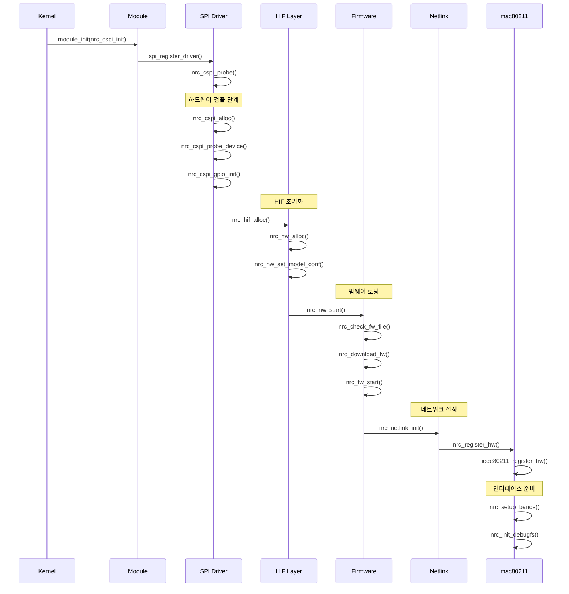

# NRC7292 드라이버 초기화 시퀀스 분석

## 개요

NRC7292 HaLow 드라이버의 초기화 시퀀스는 복잡한 다단계 프로세스로, 커널 모듈 로딩부터 네트워크 인터페이스 준비까지 체계적으로 진행됩니다. 본 문서는 실제 소스 코드 분석을 통해 각 초기화 단계의 상세한 동작 방식을 설명합니다.

## 주요 초기화 단계

### 1. 모듈 로딩 시퀀스

#### 1.1 커널 모듈 진입점
```c
// nrc-hif-cspi.c
static int __init nrc_cspi_init(void)
{
    // SPI 드라이버 등록
    ret = spi_register_driver(&nrc_cspi_driver);
    if (ret) {
        pr_info("Failed to register spi driver(%s).", 
                nrc_cspi_driver.driver.name);
        return ret;
    }
    
    return 0;
}

module_init(nrc_cspi_init);
```

#### 1.2 모듈 파라미터 초기화
드라이버는 다음과 같은 주요 모듈 파라미터들을 초기화합니다:

- **펌웨어 설정**: `fw_name`, `bd_name`
- **하드웨어 인터페이스**: `hifspeed`, `spi_bus_num`, `spi_cs_num`
- **GPIO 설정**: `spi_gpio_irq`, `power_save_gpio`
- **네트워크 파라미터**: `ampdu_mode`, `power_save`, `bss_max_idle`

### 2. 하드웨어 검출 및 초기화

#### 2.1 SPI 디바이스 프로브
```c
// nrc-hif-cspi.c
static int nrc_cspi_probe(struct spi_device *spi)
{
    struct nrc_spi_priv *priv;
    struct nrc_hif_device *hdev;
    struct nrc *nw;
    
    // 1. SPI 디바이스 초기화
    priv = nrc_cspi_alloc(spi);
    if (!priv) {
        dev_err(&spi->dev, "Failed to nrc_cspi_alloc\n");
        return -ENOMEM;
    }
    
    // 2. 하드웨어 ID 확인
    ret = nrc_cspi_probe_device(priv);
    if (ret) {
        dev_err(&spi->dev, "Failed to nrc_cspi_probe_device\n");
        goto err_cspi_free;
    }
    
    // 3. GPIO 초기화
    ret = nrc_cspi_gpio_init(spi);
    if (ret) {
        dev_err(&spi->dev, "Failed to nrc_cspi_gpio_init\n");
        goto err_cspi_free;
    }
    
    // 4. HIF 디바이스 초기화
    hdev = nrc_hif_alloc(&spi->dev, priv);
    if (!hdev) {
        dev_err(&spi->dev, "Failed to nrc_hif_alloc\n");
        goto err_gpio_free;
    }
    
    // 5. NRC 네트워크 컨텍스트 할당
    nw = nrc_nw_alloc(&spi->dev, hdev);
    if (IS_ERR(nw)) {
        dev_err(&spi->dev, "Failed to nrc_nw_alloc\n");
        goto err_hif_free;
    }
    
    // 6. 칩 ID 기반 모델 설정
    nrc_nw_set_model_conf(nw, priv->hw.sys.chip_id);
    
    // 7. 네트워크 스택 시작
    ret = nrc_nw_start(nw);
    if (ret) {
        dev_err(&spi->dev, "Failed to nrc_nw_start (%d)\n", ret);
        goto err_nw_free;
    }
    
    return 0;
}
```

#### 2.2 하드웨어 ID 확인 과정
```c
// nrc-hif-cspi.c
static int nrc_cspi_probe_device(struct nrc_spi_priv *priv)
{
    // 시스템 레지스터 읽기
    nrc_cspi_read_regs(priv, C_SPI_SYS_REG, 
                       (u8 *)&priv->hw.sys, 
                       sizeof(struct spi_sys_reg));
    
    // 칩 ID 확인
    if (priv->hw.sys.chip_id != 0x7292 && 
        priv->hw.sys.chip_id != 0x7393 && 
        priv->hw.sys.chip_id != 0x7394) {
        dev_err(&priv->spi->dev, "Unknown chip id: 0x%04x\n", 
                priv->hw.sys.chip_id);
        return -ENODEV;
    }
    
    return 0;
}
```

### 3. 드라이버 등록 및 설정

#### 3.1 네트워크 컨텍스트 할당
```c
// nrc-init.c
struct nrc *nrc_nw_alloc(struct device *dev, struct nrc_hif_device *hdev)
{
    struct ieee80211_hw *hw;
    struct nrc *nw;
    
    // 1. mac80211 하드웨어 컨텍스트 할당
    hw = nrc_mac_alloc_hw(sizeof(struct nrc), NRC_DRIVER_NAME);
    if (!hw) {
        return NULL;
    }
    
    nw = hw->priv;
    nw->hw = hw;
    nw->dev = dev;
    nw->hif = hdev;
    hdev->nw = nw;
    
    // 2. 드라이버 상태 초기화
    nw->drv_state = NRC_DRV_INIT;
    
    // 3. 펌웨어 컨텍스트 초기화
    nw->fw_priv = nrc_fw_init(nw);
    if (!nw->fw_priv) {
        dev_err(nw->dev, "Failed to initialize FW");
        goto err_hw_free;
    }
    
    // 4. 동기화 객체 초기화
    mutex_init(&nw->target_mtx);
    mutex_init(&nw->state_mtx);
    spin_lock_init(&nw->vif_lock);
    
    // 5. 완료 대기 객체 초기화
    init_completion(&nw->hif_tx_stopped);
    init_completion(&nw->hif_rx_stopped);
    init_completion(&nw->hif_irq_stopped);
    init_completion(&nw->wim_responded);
    
    // 6. 워크큐 생성
    nw->workqueue = create_singlethread_workqueue("nrc_wq");
    nw->ps_wq = create_singlethread_workqueue("nrc_ps_wq");
    
    // 7. 지연 작업 초기화
    INIT_DELAYED_WORK(&nw->roc_finish, nrc_mac_roc_finish);
    INIT_DELAYED_WORK(&nw->rm_vendor_ie_wowlan_pattern, 
                      nrc_rm_vendor_ie_wowlan_pattern);
    
    return nw;
}
```

#### 3.2 칩 ID 기반 모델 설정
```c
// nrc-init.c
int nrc_nw_set_model_conf(struct nrc *nw, u16 chip_id)
{
    nw->chip_id = chip_id;
    
    switch (nw->chip_id) {
        case 0x7292:
            nw->hw_queues = 6;
            nw->wowlan_pattern_num = 1;
            break;
        case 0x7393:
        case 0x7394:
            nw->hw_queues = 11;
            nw->wowlan_pattern_num = 2;
            break;
        default:
            dev_err(nw->dev, "Unknown Newracom IEEE80211 chipset %04x", 
                    nw->chip_id);
            return -ENODEV;
    }
    
    return 0;
}
```

### 4. 펌웨어 로딩

#### 4.1 펌웨어 검증 및 로딩
```c
// nrc-init.c
int nrc_nw_start(struct nrc *nw)
{
    int ret;
    int i;
    
    // 1. 드라이버 상태 확인
    if (nw->drv_state != NRC_DRV_INIT) {
        dev_err(nw->dev, "Invalid NW state (%d)\n", nw->drv_state);
        return -EINVAL;
    }
    
    // 2. 부트 준비 상태 확인
    if (fw_name && !nrc_check_boot_ready(nw)) {
        dev_err(nw->dev, "Boot not ready\n");
        return -EINVAL;
    }
    
    // 3. 보드 데이터 확인
    #if defined(CONFIG_SUPPORT_BD)
    ret = nrc_check_bd(nw);
    if (ret) {
        dev_err(nw->dev, "Failed to nrc_check_bd\n");
        return -EINVAL;
    }
    #endif
    
    // 4. 펌웨어 파일 확인 및 다운로드
    ret = nrc_check_fw_file(nw);
    if (ret == true) {
        nrc_download_fw(nw);
        nrc_release_fw(nw);
    }
    
    // 5. 펌웨어 준비 대기
    for (i = 0; i < MAX_FW_RETRY_CNT; i++) {
        if (nrc_check_fw_ready(nw)) {
            goto ready;
        }
        mdelay(100);
    }
    
    dev_err(nw->dev, "Failed to nrc_check_fw_ready\n");
    return -ETIMEDOUT;

ready:
    // 6. 드라이버 상태 업데이트
    nw->drv_state = NRC_DRV_START;
    
    // 7. HIF 시작
    ret = nrc_hif_start(nw->hif);
    if (ret) {
        dev_err(nw->dev, "Failed to nrc_hif_start\n");
        return ret;
    }
    
    // 8. 펌웨어 시작
    ret = nrc_fw_start(nw);
    if (ret) {
        dev_err(nw->dev, "Failed to nrc_fw_start\n");
        return ret;
    }
    
    // 9. Netlink 인터페이스 초기화
    ret = nrc_netlink_init(nw);
    if (ret) {
        dev_err(nw->dev, "Failed to nrc_netlink_init\n");
        return ret;
    }
    
    // 10. mac80211 하드웨어 등록
    ret = nrc_register_hw(nw);
    if (ret) {
        dev_err(nw->dev, "Failed to nrc_register_hw\n");
        nrc_netlink_exit();
        return ret;
    }
    
    // 11. 디버그 파일시스템 초기화
    nrc_init_debugfs(nw);
    
    return 0;
}
```

#### 4.2 펌웨어 다운로드 과정
```c
// nrc-fw.c
void nrc_download_fw(struct nrc *nw)
{
    struct firmware *fw = nw->fw;
    struct nrc_fw_priv *priv = nw->fw_priv;
    struct nrc_hif_device *hdev = nw->hif;
    
    // 1. 펌웨어 청crk 설정
    priv->num_chunks = DIV_ROUND_UP(fw->size, FRAG_BYTES);
    priv->csum = true;
    priv->fw = fw;
    priv->fw_data_pos = fw->data;
    priv->remain_bytes = fw->size;
    priv->cur_chunk = 0;
    priv->index = 0;
    priv->start_addr = FW_START_ADDR;
    priv->ack = true;
    
    // 2. 인터럽트 비활성화
    nrc_hif_disable_irq(hdev);
    
    // 3. 펌웨어 청크 전송
    do {
        nrc_fw_send_frag(nw, priv);
    } while (nrc_fw_check_next_frag(nw, priv));
    
    priv->fw_requested = false;
}
```

### 5. 인터럽트 및 리소스 설정

#### 5.1 인터럽트 핸들러 등록
```c
// nrc-hif-cspi.c
static int nrc_cspi_gpio_init(struct spi_device *spi)
{
    int ret;
    
    // GPIO 요청
    ret = gpio_request(spi_gpio_irq, "spi_gpio_irq");
    if (ret) {
        dev_err(&spi->dev, "Failed to request gpio %d\n", spi_gpio_irq);
        return ret;
    }
    
    // GPIO 입력 방향 설정
    ret = gpio_direction_input(spi_gpio_irq);
    if (ret) {
        dev_err(&spi->dev, "Failed to set gpio direction\n");
        gpio_free(spi_gpio_irq);
        return ret;
    }
    
    // IRQ 핸들러 등록
    ret = request_threaded_irq(gpio_to_irq(spi_gpio_irq), 
                              NULL, nrc_cspi_isr,
                              IRQF_TRIGGER_LOW | IRQF_ONESHOT,
                              "nrc_cspi_irq", priv);
    if (ret) {
        dev_err(&spi->dev, "Failed to request irq\n");
        gpio_free(spi_gpio_irq);
        return ret;
    }
    
    return 0;
}
```

#### 5.2 메모리 및 큐 할당
```c
// nrc-hif-cspi.c
static struct nrc_spi_priv *nrc_cspi_alloc(struct spi_device *spi)
{
    struct nrc_spi_priv *priv;
    
    // 프라이빗 구조체 할당
    priv = kzalloc(sizeof(struct nrc_spi_priv), GFP_KERNEL);
    if (!priv) {
        return NULL;
    }
    
    // SPI 디바이스 설정
    priv->spi = spi;
    
    // 스핀락 초기화
    spin_lock_init(&priv->lock);
    
    // 대기 큐 초기화
    init_waitqueue_head(&priv->wait);
    
    // 뮤텍스 초기화
    mutex_init(&priv->bus_lock_mutex);
    
    // 슬롯 초기화
    priv->slot[TX_SLOT].size = 512;
    priv->slot[RX_SLOT].size = 512;
    
    // 워크큐 초기화
    INIT_DELAYED_WORK(&priv->work, nrc_cspi_work);
    
    return priv;
}
```

### 6. VIF (Virtual Interface) 설정

#### 6.1 mac80211 하드웨어 등록
```c
// nrc-mac80211.c
int nrc_register_hw(struct nrc *nw)
{
    struct ieee80211_hw *hw = nw->hw;
    int ret;
    
    // 1. 하드웨어 능력 설정
    ieee80211_hw_set(hw, SIGNAL_DBM);
    ieee80211_hw_set(hw, SUPPORTS_PS);
    ieee80211_hw_set(hw, SUPPORTS_DYNAMIC_PS);
    ieee80211_hw_set(hw, AMPDU_AGGREGATION);
    ieee80211_hw_set(hw, SPECTRUM_MGMT);
    
    // 2. 하드웨어 파라미터 설정
    hw->max_rates = 8;
    hw->max_rate_tries = 3;
    hw->queues = nw->hw_queues;
    hw->sta_data_size = sizeof(struct nrc_sta);
    hw->vif_data_size = sizeof(struct nrc_vif);
    
    // 3. 지원 대역 설정
    ret = nrc_setup_bands(nw);
    if (ret) {
        nrc_mac_dbg("Failed to setup bands");
        return ret;
    }
    
    // 4. mac80211에 하드웨어 등록
    ret = ieee80211_register_hw(hw);
    if (ret) {
        nrc_mac_dbg("Failed to register hw");
        return ret;
    }
    
    return 0;
}
```

#### 6.2 인터페이스 추가 과정
```c
// nrc-mac80211.c
static int nrc_op_add_interface(struct ieee80211_hw *hw,
                               struct ieee80211_vif *vif)
{
    struct nrc *nw = hw->priv;
    struct nrc_vif *i_vif = (void *)vif->drv_priv;
    int ret;
    
    // 1. VIF 타입 검증
    if (vif->type != NL80211_IFTYPE_STATION &&
        vif->type != NL80211_IFTYPE_AP &&
        vif->type != NL80211_IFTYPE_MESH_POINT &&
        vif->type != NL80211_IFTYPE_MONITOR) {
        return -EOPNOTSUPP;
    }
    
    // 2. VIF 인덱스 할당
    i_vif->index = nrc_get_vif_index(nw);
    if (i_vif->index < 0) {
        return -EBUSY;
    }
    
    // 3. MAC 주소 설정
    if (nw->has_macaddr[i_vif->index]) {
        memcpy(vif->addr, nw->mac_addr[i_vif->index].addr, ETH_ALEN);
    } else {
        eth_random_addr(vif->addr);
    }
    
    // 4. 펌웨어에 VIF 추가 요청
    ret = nrc_add_vif(nw, vif);
    if (ret) {
        nrc_free_vif_index(nw, i_vif->index);
        return ret;
    }
    
    return 0;
}
```

## 초기화 시퀀스 다이어그램



## 주요 초기화 함수 호출 순서

1. **모듈 진입**
   - `nrc_cspi_init()` → `spi_register_driver()`

2. **디바이스 프로브**
   - `nrc_cspi_probe()` → `nrc_cspi_alloc()` → `nrc_cspi_probe_device()`

3. **하드웨어 초기화**
   - `nrc_cspi_gpio_init()` → `nrc_hif_alloc()` → `nrc_nw_alloc()`

4. **네트워크 시작**
   - `nrc_nw_start()` → `nrc_check_fw_file()` → `nrc_download_fw()`

5. **서비스 등록**
   - `nrc_fw_start()` → `nrc_netlink_init()` → `nrc_register_hw()`

6. **최종 초기화**
   - `ieee80211_register_hw()` → `nrc_init_debugfs()`

## 초기화 중 주요 상태 변화

```
NRC_DRV_INIT → NRC_DRV_START → NRC_DRV_RUNNING
```

- **NRC_DRV_INIT**: 드라이버 초기화 상태
- **NRC_DRV_START**: 펌웨어 로딩 완료 후 서비스 시작
- **NRC_DRV_RUNNING**: 모든 초기화 완료, 정상 동작 상태

## 에러 처리 및 복구 메커니즘

### 초기화 실패 시 정리 순서
1. **Netlink 정리**: `nrc_netlink_exit()`
2. **HIF 정리**: `nrc_hif_cleanup()`, `nrc_hif_free()`
3. **GPIO 정리**: `nrc_cspi_gpio_free()`
4. **메모리 정리**: `nrc_nw_free()`, `nrc_cspi_free()`

### 재시도 메커니즘
- 펌웨어 준비 상태: 최대 30회 재시도 (100ms 간격)
- 하드웨어 응답: 타임아웃 설정으로 무한 대기 방지

## 성능 최적화 고려사항

### 메모리 할당 최적화
- 슬롯 크기: TX/RX 각각 512 바이트
- 크레딧 시스템: AC별 차등 할당 (BE: 40, VO/VI: 8, BK: 4)

### 인터럽트 처리 최적화
- Threaded IRQ 사용으로 빠른 응답성 확보
- 워크큐 활용으로 비동기 처리 구현

## 디버깅 정보

### 주요 디버그 로그 포인트
- 하드웨어 ID 확인: `chip_id` 값 출력
- 펌웨어 로딩: 진행 상황 및 체크섬 검증
- MAC 주소 설정: 각 VIF별 주소 할당 확인
- 네트워크 등록: mac80211 등록 성공/실패

### 문제 진단 가이드
1. **SPI 통신 문제**: GPIO IRQ 설정 및 버스 속도 확인
2. **펌웨어 로딩 실패**: 펌웨어 파일 경로 및 체크섬 검증
3. **인터페이스 생성 실패**: MAC 주소 할당 및 VIF 타입 확인

이 초기화 시퀀스는 NRC7292 HaLow 드라이버의 안정적인 동작을 위한 핵심 프로세스로, 각 단계의 성공적인 완료가 전체 시스템의 정상 동작을 보장합니다.