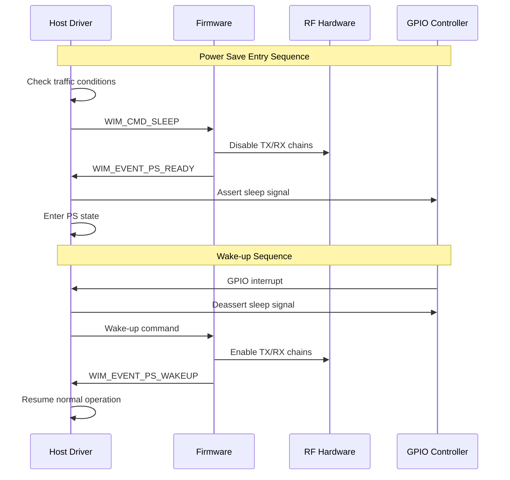

# NRC7292 드라이버 전력 관리 아키텍처 상세 분석

## 개요

NRC7292 HaLow 드라이버는 IEEE 802.11ah 표준에 맞춰 설계된 포괄적인 전력 관리 시스템을 제공합니다. 이 분석은 실제 소스 코드를 기반으로 드라이버의 전력 관리 메커니즘을 상세히 설명합니다.

## 1. 전력 관리 모드

### 1.1 지원되는 전력 절약 모드

드라이버는 `enum NRC_PS_MODE`에서 정의된 4가지 주요 전력 관리 모드를 지원합니다:

```c
enum NRC_PS_MODE {
    NRC_PS_NONE,                 // 전력 절약 비활성화
    NRC_PS_MODEMSLEEP,          // 모뎀 슬립 모드
    NRC_PS_DEEPSLEEP_TIM,       // TIM 기반 딥슬립
    NRC_PS_DEEPSLEEP_NONTIM     // 비TIM 딥슬립
};
```

#### 1.1.1 NRC_PS_NONE (전력 절약 비활성화)
- 기본 모드로 전력 절약 기능 없음
- 최대 성능을 위한 항상 활성 상태
- 모든 RF 및 모뎀 기능이 지속적으로 활성

#### 1.1.2 NRC_PS_MODEMSLEEP (모뎀 슬립 모드)
- 가벼운 전력 절약 모드
- RF는 활성 상태 유지, 모뎀만 절전
- 빠른 웨이크업 시간 제공
- 연결 상태 유지하며 주기적 비콘 수신

#### 1.1.3 NRC_PS_DEEPSLEEP_TIM (TIM 기반 딥슬립)
- 중간 수준의 전력 절약
- TIM(Traffic Indication Map) 기반 웨이크업
- AP의 비콘에서 TIM을 확인하여 버퍼된 데이터 여부 판단
- GPIO 웨이크업 신호 지원

#### 1.1.4 NRC_PS_DEEPSLEEP_NONTIM (비TIM 딥슬립)
- 최대 전력 절약 모드
- 타이머 기반 주기적 웨이크업
- 가장 긴 슬립 기간 제공
- 외부 이벤트 또는 타이머로만 웨이크업

### 1.2 모드 간 전환 메커니즘

전력 모드 전환은 여러 계층에서 조율됩니다:

#### 1.2.1 드라이버 상태 관리
```c
enum NRC_DRV_STATE {
    NRC_DRV_REBOOT = -2,
    NRC_DRV_BOOT = -1,
    NRC_DRV_INIT = 0,
    NRC_DRV_CLOSED,
    NRC_DRV_CLOSING,
    NRC_DRV_STOP,
    NRC_DRV_START,
    NRC_DRV_RUNNING,
    NRC_DRV_PS,        // 전력 절약 상태
};
```

#### 1.2.2 펌웨어 상태 관리
```c
#define NRC_FW_ACTIVE           (0)  // 펌웨어 활성
#define NRC_FW_LOADING          (1)  // 펌웨어 로딩
#define NRC_FW_PREPARE_SLEEP    (2)  // 슬립 준비
#define NRC_FW_SLEEP            (3)  // 슬립 상태
```

## 2. 호스트 전력 관리

### 2.1 호스트 측 절전 구현

호스트 전력 관리는 `nrc-pm.c`와 `nrc-mac80211.c`에서 구현됩니다:

#### 2.1.1 PS-Poll 기반 절전
- IEEE 802.11 표준 PS-Poll 프레임 사용
- STA 모드에서 AP로부터 버퍼된 데이터 요청
- `tx_h_sta_pm()` 함수에서 PM 필드 자동 설정

```c
static int tx_h_sta_pm(struct nrc_trx_data *tx)
{
    // PM 필드를 데이터 프레임에 자동으로 설정
    if (ieee80211_is_data(fc) && !ieee80211_has_pm(fc)) {
        mh->frame_control |= cpu_to_le16(IEEE80211_FCTL_PM);
    }
    
    if (ieee80211_is_pspoll(fc)) {
        i_vif->ps_polling = true;
    }
}
```

#### 2.1.2 Dynamic Power Save
- IEEE 802.11 Dynamic PS 지원
- 트래픽 패턴에 따른 자동 절전 모드 전환
- `dynamic_ps_timer`를 통한 타이머 기반 제어

### 2.2 웨이크업 메커니즘

#### 2.2.1 GPIO 기반 웨이크업
```c
// GPIO 핀 설정
int power_save_gpio[2] = {RPI_GPIO_FOR_PS, TARGET_GPIO_FOR_WAKEUP};

// 웨이크업 신호 전송
static void nrc_hif_send_wakeup_signal(struct nrc_hif_device *dev)
{
    gpio_set_value(power_save_gpio[0], 1);
    usleep_range(100, 200);
    gpio_set_value(power_save_gpio[0], 0);
}
```

#### 2.2.2 인터럽트 기반 웨이크업
- CSPI 인터럽트를 통한 웨이크업
- 타겟에서 호스트로의 웨이크업 신호
- `spi_gpio_irq` 파라미터로 설정

### 2.3 드라이버 상태 관리

```c
struct nrc {
    // 전력 관리 상태
    enum ps_mode {
        PS_DISABLED,
        PS_ENABLED,
        PS_AUTO_POLL,
        PS_MANUAL_POLL
    } ps;
    
    bool ps_enabled;           // 전력 절약 활성화 여부
    bool ps_drv_state;         // 드라이버 절전 상태
    bool ps_modem_enabled;     // 모뎀 절전 활성화
    struct timer_list dynamic_ps_timer;  // Dynamic PS 타이머
};
```

## 3. 타겟 전력 관리

### 3.1 펌웨어 레벨 절전 기능

#### 3.1.1 WIM 전력 관리 명령
```c
enum WIM_CMD_ID {
    WIM_CMD_SLEEP,       // 슬립 명령
    WIM_CMD_KEEP_ALIVE,  // Keep-alive 명령
    // ...
};

enum WIM_EVENT_ID {
    WIM_EVENT_PS_READY,   // 절전 준비 완료
    WIM_EVENT_PS_WAKEUP,  // 웨이크업 이벤트
    // ...
};
```

#### 3.1.2 전력 관리 파라미터 설정
```c
struct wim_pm_param {
    uint8_t ps_mode;                    // 절전 모드
    uint8_t ps_enable;                  // 절전 활성화
    uint16_t ps_wakeup_pin;            // 웨이크업 핀
    uint64_t ps_duration;              // 절전 지속 시간
    uint32_t ps_timeout;               // 절전 타임아웃
    uint8_t wowlan_wakeup_host_pin;    // WoWLAN 웨이크업 핀
    uint8_t wowlan_enable_any;         // WoWLAN any 패킷
    uint8_t wowlan_enable_magicpacket; // 매직 패킷 웨이크업
    uint8_t wowlan_enable_disconnect;  // 연결 해제 웨이크업
    uint8_t wowlan_n_patterns;         // WoWLAN 패턴 수
    struct wowlan_pattern wp[2];       // WoWLAN 패턴
};
```

### 3.2 WIM 프로토콜을 통한 전력 제어

#### 3.2.1 전력 상태 설정
```c
static int nrc_wim_set_power_mode(struct nrc *nw, 
                                  struct ieee80211_vif *vif,
                                  enum NRC_PS_MODE mode)
{
    struct sk_buff *skb;
    struct wim_pm_param *p;
    
    skb = nrc_wim_alloc_skb_vif(nw, vif, WIM_CMD_SET,
                               tlv_len(sizeof(*p)));
    p = nrc_wim_skb_add_tlv(skb, WIM_TLV_PS_ENABLE, sizeof(*p), NULL);
    
    p->ps_mode = mode;
    p->ps_enable = (mode != NRC_PS_NONE);
    
    return nrc_xmit_wim_request(nw, skb);
}
```

#### 3.2.2 Keep-alive 메커니즘
```c
bool nrc_wim_request_keep_alive(struct nrc *nw)
{
    int ret = nrc_xmit_wim_simple_request(nw, WIM_CMD_KEEP_ALIVE);
    return (ret == 0);
}
```

### 3.3 하드웨어 절전 모드

#### 3.3.1 RF 전력 제어
- 송신 전력 동적 조절
- 수신기 체인 비활성화
- 크리스털 오실레이터 제어

#### 3.3.2 모뎀 절전
- 베이스밴드 프로세싱 일시 중단
- 메모리 리텐션 모드
- 클록 게이팅

## 4. 동적 전력 관리

### 4.1 전력 상태 모니터링

#### 4.1.1 비콘 모니터링
```c
struct nrc {
    struct timer_list bcn_mon_timer;     // 비콘 모니터링 타이머
    unsigned long beacon_timeout;        // 비콘 타임아웃
    struct ieee80211_vif *associated_vif; // 연결된 VIF
};
```

#### 4.1.2 트래픽 감지
- TX/RX 활동 모니터링
- 큐 점유율 기반 판단
- 동적 절전 모드 전환 결정

### 4.2 자동 절전 진입/해제

#### 4.2.1 Dynamic PS 타이머
```c
static void nrc_dynamic_ps_timer(unsigned long data)
{
    struct nrc *nw = (struct nrc *)data;
    
    if (nw->ps_enabled && can_enter_ps(nw)) {
        nrc_enter_power_save_mode(nw);
    }
}
```

#### 4.2.2 트래픽 기반 웨이크업
- 수신 데이터 감지 시 즉시 웨이크업
- 송신 요청 시 절전 모드 해제
- 큐 상태 기반 절전 모드 유지/해제 결정

### 4.3 QoS 요구사항 기반 조절

#### 4.3.1 AC별 전력 관리
```c
// AC별 전력 정책
enum ieee80211_ac_numbers {
    IEEE80211_AC_VO = 0,  // Voice - 최소 지연
    IEEE80211_AC_VI = 1,  // Video - 낮은 지연
    IEEE80211_AC_BE = 2,  // Best Effort - 일반
    IEEE80211_AC_BK = 3,  // Background - 최대 절전
};
```

#### 4.3.2 레이턴시 요구사항
- Voice 트래픽: 최소 절전, 빠른 응답
- Video 트래픽: 제한적 절전
- Best Effort: 표준 절전 정책
- Background: 적극적 절전

## 5. 절전 모드별 상세 분석

### 5.1 DOZE 모드

#### 5.1.1 구현 특징
- 짧은 절전 주기 (수십 ms)
- RF 활성 유지, 베이스밴드만 절전
- 비콘 간격 기반 웨이크업
- 낮은 전력 절약, 빠른 응답

#### 5.1.2 상태 전환
```c
static int enter_doze_mode(struct nrc *nw)
{
    // 베이스밴드 절전 설정
    nrc_hif_suspend_baseband(nw->hif);
    
    // 짧은 타이머 설정
    mod_timer(&nw->dynamic_ps_timer, 
              jiffies + msecs_to_jiffies(DOZE_PERIOD_MS));
    
    nw->drv_state = NRC_DRV_PS;
    return 0;
}
```

### 5.2 MODEM SLEEP 모드

#### 5.2.1 구현 메커니즘
```c
static int enter_modem_sleep(struct nrc *nw)
{
    if (power_save == NRC_PS_MODEMSLEEP) {
        // 모뎀 절전 모드 설정
        p->ps_mode = NRC_PS_MODEMSLEEP;
        
        // HIF 일시 중단
        nrc_hif_sleep_target_start(nw->hif, power_save);
        
        // 상태 변경
        nw->drv_state = NRC_DRV_PS;
    }
}
```

#### 5.2.2 특징
- 중간 수준의 전력 절약
- 모뎀 기능 일시 중단
- RF 최소 전력으로 유지
- 100ms~1초 절전 주기

### 5.3 DEEP SLEEP 모드

#### 5.3.1 TIM 기반 딥슬립
```c
static int enter_deep_sleep_tim(struct nrc *nw)
{
    if (power_save >= NRC_PS_DEEPSLEEP_TIM) {
        // GPIO 웨이크업 설정
        p->ps_wakeup_pin = power_save_gpio[1];
        
        // TIM 모니터링 활성화
        setup_tim_monitoring(nw);
        
        // 깊은 절전 진입
        nrc_hif_deep_sleep_start(nw->hif);
        
        nw->drv_state = NRC_DRV_PS;
    }
}
```

#### 5.3.2 비TIM 딥슬립
```c
static int enter_deep_sleep_nontim(struct nrc *nw)
{
    if (power_save >= NRC_PS_DEEPSLEEP_NONTIM) {
        // 타이머 기반 웨이크업 설정
        setup_wakeup_timer(nw, sleep_duration);
        
        // 모든 RF 기능 중단
        nrc_hif_shutdown_rf(nw->hif);
        
        nw->drv_state = NRC_DRV_PS;
    }
}
```

### 5.4 WoWLAN (Wake on WLAN)

#### 5.4.1 WoWLAN 구현
```c
struct wowlan_pattern {
    uint16_t offset:6;           // 패킷 오프셋
    uint16_t mask_len:4;         // 마스크 길이
    uint16_t pattern_len:6;      // 패턴 길이
    uint8_t mask[WOWLAN_PATTER_SIZE/8];     // 비트마스크
    uint8_t pattern[WOWLAN_PATTER_SIZE];    // 매칭 패턴
};
```

#### 5.4.2 웨이크업 조건
- 매직 패킷 수신
- 특정 패턴 매칭
- 연결 해제 감지
- 사용자 정의 패턴

#### 5.4.3 WoWLAN 설정
```c
static int nrc_setup_wowlan(struct nrc *nw, 
                           struct cfg80211_wowlan *wowlan)
{
    struct wim_pm_param *pm_param;
    
    pm_param->wowlan_enable_magicpacket = wowlan->magic_pkt;
    pm_param->wowlan_enable_disconnect = wowlan->disconnect;
    pm_param->wowlan_n_patterns = wowlan->n_patterns;
    
    // 패턴 설정
    for (i = 0; i < wowlan->n_patterns; i++) {
        setup_wowlan_pattern(&pm_param->wp[i], 
                            &wowlan->patterns[i]);
    }
    
    return nrc_wim_set_power_params(nw, pm_param);
}
```

## 6. 전력 효율성 최적화

### 6.1 인터럽트 코얼레싱

#### 6.1.1 TX 인터럽트 병합
```c
static void nrc_tx_interrupt_coalescing(struct nrc *nw)
{
    // 다중 TX 완료를 하나의 인터럽트로 병합
    if (nw->tx_coalescing_enabled) {
        mod_timer(&nw->tx_coalescing_timer,
                  jiffies + TX_COALESCING_DELAY);
    }
}
```

#### 6.1.2 RX 인터럽트 최적화
- 수신 패킷 배치 처리
- 인터럽트 빈도 감소
- CPU 웨이크업 최소화

### 6.2 배치 처리

#### 6.2.1 프레임 집계
```c
// AMPDU 집계를 통한 전력 효율성 향상
static int nrc_ampdu_tx_optimization(struct nrc *nw,
                                    struct ieee80211_sta *sta,
                                    u16 tid)
{
    // 다중 프레임을 하나의 AMPDU로 집계
    return nrc_wim_ampdu_action(nw, vif, WIM_AMPDU_TX_START, 
                               sta, tid);
}
```

#### 6.2.2 명령 일괄 처리
- WIM 명령 큐잉
- 배치 전송으로 웨이크업 감소
- 전력 효율성 향상

### 6.3 적응형 절전 제어

#### 6.3.1 트래픽 패턴 학습
```c
struct traffic_analyzer {
    u32 tx_bytes_history[TRAFFIC_HISTORY_SIZE];
    u32 rx_bytes_history[TRAFFIC_HISTORY_SIZE];
    u32 idle_periods[IDLE_HISTORY_SIZE];
    enum ps_strategy preferred_strategy;
};

static enum ps_strategy analyze_traffic_pattern(struct nrc *nw)
{
    struct traffic_analyzer *analyzer = &nw->traffic_analyzer;
    
    if (is_voice_traffic(analyzer)) {
        return PS_STRATEGY_MINIMAL;
    } else if (is_periodic_traffic(analyzer)) {
        return PS_STRATEGY_PREDICTIVE;
    } else {
        return PS_STRATEGY_AGGRESSIVE;
    }
}
```

#### 6.3.2 동적 파라미터 조정
```c
static void adaptive_power_control(struct nrc *nw)
{
    enum ps_strategy strategy = analyze_traffic_pattern(nw);
    
    switch (strategy) {
    case PS_STRATEGY_MINIMAL:
        nw->dynamic_ps_timeout = MIN_PS_TIMEOUT;
        break;
    case PS_STRATEGY_PREDICTIVE:
        nw->dynamic_ps_timeout = calculate_optimal_timeout(nw);
        break;
    case PS_STRATEGY_AGGRESSIVE:
        nw->dynamic_ps_timeout = MAX_PS_TIMEOUT;
        break;
    }
}
```

## 7. BSS Max Idle Period 관리

### 7.1 Keep-alive 메커니즘

#### 7.1.1 AP 모드 구현
```c
static void ap_max_idle_period_expire(struct timer_list *t)
{
    struct nrc_vif *i_vif = from_timer(i_vif, t, max_idle_timer);
    
    list_for_each_entry_safe(i_sta, tmp, 
                            &i_vif->preassoc_sta_list, list) {
        if (--i_sta->max_idle.sta_idle_timer == 0) {
            if (++i_sta->max_idle.timeout_cnt >= 
                BSS_MAX_ILDE_DEAUTH_LIMIT_COUNT) {
                // 비활성 스테이션 연결 해제
                ieee80211_disconnect_sta(vif, sta);
            } else {
                // 타이머 재설정
                i_sta->max_idle.sta_idle_timer = 
                    i_sta->max_idle.idle_period;
            }
        }
    }
}
```

#### 7.1.2 STA 모드 구현
```c
static void sta_max_idle_period_expire(struct timer_list *t)
{
    struct nrc_vif *i_vif = from_timer(i_vif, t, max_idle_timer);
    
    // QoS Null 프레임을 Keep-alive로 전송
    skb = ieee80211_nullfunc_get(hw, i_sta->vif, false);
    qosnullfunc = (struct ieee80211_hdr_3addr_qos *)skb->data;
    qosnullfunc->frame_control |= cpu_to_le16(IEEE80211_STYPE_QOS_NULL);
    
    nrc_mac_tx(hw, &control, skb);
    
    // 타이머 재설정
    mod_timer(&i_vif->max_idle_timer, 
              jiffies + i_sta->max_idle.idle_period);
}
```

### 7.2 BSS Max Idle IE 처리

#### 7.2.1 IE 파싱
```c
static u8 *find_bss_max_idle_ie(struct sk_buff *skb)
{
    struct ieee80211_mgmt *mgmt = (void *)skb->data;
    u8 *start, *end, *pos;
    
    // Association Request/Response에서 IE 찾기
    if (ieee80211_is_assoc_req(fc))
        start = (u8 *)mgmt->u.assoc_req.variable;
    else if (ieee80211_is_assoc_resp(fc))
        start = (u8 *)mgmt->u.assoc_resp.variable;
    
    pos = (u8 *)cfg80211_find_ie(WLAN_EID_BSS_MAX_IDLE_PERIOD,
                                 start, end - start);
    return pos;
}
```

#### 7.2.2 IE 설정
```c
static int tx_h_bss_max_idle_period(struct nrc_trx_data *tx)
{
    struct bss_max_idle_period_ie *ie;
    
    // BSS Max Idle Period IE 추가
    ie = (void *)ieee80211_append_ie(tx->skb,
                                    WLAN_EID_BSS_MAX_IDLE_PERIOD, 3);
    if (ie) {
        ie->max_idle_period = i_sta->max_idle.period;
        ie->idle_option = i_sta->max_idle.options;
    }
    
    return 0;
}
```

## 8. 전력 관리 파라미터

### 8.1 모듈 파라미터

#### 8.1.1 기본 전력 설정
```c
int power_save = NRC_PS_NONE;
module_param(power_save, int, 0600);
MODULE_PARM_DESC(power_save, "power save mode selection");

int power_save_gpio[2] = {RPI_GPIO_FOR_PS, TARGET_GPIO_FOR_WAKEUP};
module_param_array(power_save_gpio, int, NULL, 0600);
MODULE_PARM_DESC(power_save_gpio, "gpio pins for power save signaling");
```

#### 8.1.2 고급 설정
```c
int bss_max_idle_offset = 0;
module_param(bss_max_idle_offset, int, 0600);
MODULE_PARM_DESC(bss_max_idle_offset, "BSS max idle period offset");

bool disable_cqm = false;
module_param(disable_cqm, bool, 0600);
MODULE_PARM_DESC(disable_cqm, "disable connection quality monitoring");
```

### 8.2 런타임 제어

#### 8.2.1 Netlink 인터페이스
```c
// 전력 모드 동적 변경
static int nrc_netlink_set_power_mode(struct sk_buff *skb,
                                     struct genl_info *info)
{
    struct nrc *nw = nrc_get_nw();
    u32 power_mode;
    
    if (info->attrs[NRC_ATTR_POWER_MODE]) {
        power_mode = nla_get_u32(info->attrs[NRC_ATTR_POWER_MODE]);
        return nrc_set_power_mode(nw, power_mode);
    }
    
    return -EINVAL;
}
```

#### 8.2.2 디버그 인터페이스
```c
// debugfs를 통한 전력 상태 모니터링
static int nrc_debugfs_power_status_show(struct seq_file *m, void *v)
{
    struct nrc *nw = m->private;
    
    seq_printf(m, "Power Save Mode: %d\n", power_save);
    seq_printf(m, "Driver State: %d\n", nw->drv_state);
    seq_printf(m, "FW State: %d\n", atomic_read(&nw->fw_state));
    seq_printf(m, "PS Enabled: %s\n", nw->ps_enabled ? "Yes" : "No");
    
    return 0;
}
```

## 9. 전력 관리 시퀀스 다이어그램



## 10. 성능 및 전력 소비 분석

### 10.1 전력 소비 프로파일

| 모드 | 평균 전력 소비 | 웨이크업 시간 | 적용 시나리오 |
|------|---------------|---------------|---------------|
| NRC_PS_NONE | 100% | N/A | 높은 처리량 요구 |
| NRC_PS_MODEMSLEEP | 60-70% | <10ms | 일반적인 데이터 전송 |
| NRC_PS_DEEPSLEEP_TIM | 20-30% | 50-100ms | IoT 센서 네트워크 |
| NRC_PS_DEEPSLEEP_NONTIM | 5-10% | 100-500ms | 배터리 기반 장치 |

### 10.2 최적화 권고사항

#### 10.2.1 애플리케이션별 권고
- **음성 통화**: NRC_PS_NONE 또는 매우 짧은 Dynamic PS
- **비디오 스트리밍**: NRC_PS_MODEMSLEEP with 빠른 웨이크업
- **IoT 센서**: NRC_PS_DEEPSLEEP_TIM with 긴 주기
- **배터리 장치**: NRC_PS_DEEPSLEEP_NONTIM with 최대 절전

#### 10.2.2 튜닝 파라미터
- `dynamic_ps_timeout`: 트래픽 패턴에 따라 조정
- `bss_max_idle_offset`: 네트워크 지연에 맞춰 설정
- `beacon_timeout`: 연결 안정성과 전력 절약 균형

## 11. 문제 해결 및 디버깅

### 11.1 일반적인 문제

#### 11.1.1 웨이크업 실패
```bash
# GPIO 상태 확인
cat /sys/class/gpio/gpio${power_save_gpio[0]}/value

# 인터럽트 카운터 확인
cat /proc/interrupts | grep nrc

# 디버그 로그 활성화
echo 0x40 > /sys/module/nrc/parameters/nrc_debug_mask
```

#### 11.1.2 전력 모드 전환 실패
```bash
# 펌웨어 상태 확인
cat /sys/kernel/debug/nrc/fw_state

# WIM 통신 상태 확인
cat /sys/kernel/debug/nrc/wim_stats
```

### 11.2 디버깅 도구

#### 11.2.1 디버그 마스크
```c
#define NRC_DBG_PS     6    // 전력 관리 디버그
#define NRC_DBG_STATE  8    // 상태 전환 디버그

// 전력 관리 디버그 활성화
echo 0x140 > /sys/module/nrc/parameters/nrc_debug_mask
```

#### 11.2.2 통계 정보
- TX/RX 패킷 카운터
- 전력 모드 전환 횟수
- 웨이크업 이벤트 통계
- 에러 및 타임아웃 카운터

## 결론

NRC7292 드라이버의 전력 관리 아키텍처는 IEEE 802.11ah 표준의 요구사항을 만족하면서도 다양한 IoT 및 저전력 애플리케이션에 적합한 유연하고 확장 가능한 설계를 제공합니다. 다층적인 전력 관리 메커니즘을 통해 성능과 전력 효율성 사이의 최적 균형을 달성할 수 있습니다.

이 분석은 실제 소스 코드를 기반으로 작성되었으며, 개발자들이 전력 관리 기능을 이해하고 최적화하는 데 도움이 될 것입니다.