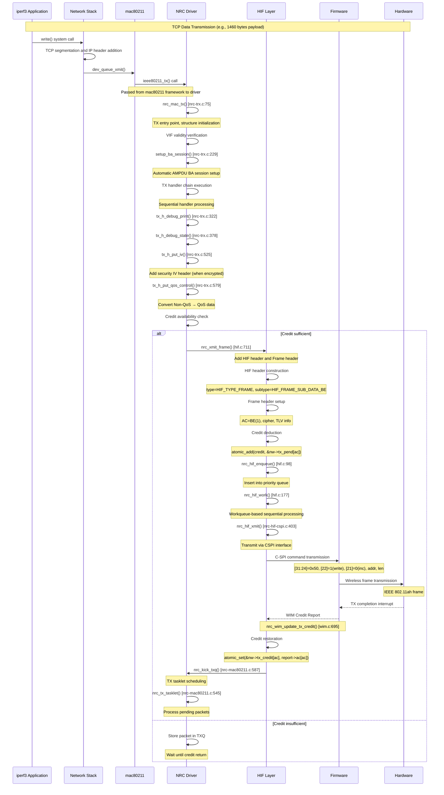

# NRC7292 TX Path Detailed Source Code Analysis

## Overview

This document provides a comprehensive source code analysis of the TX (transmission) path in the NRC7292 HaLow (IEEE 802.11ah) driver. The TX path covers the entire data flow from the mac80211 kernel framework to the final hardware transmission.

## 1. TX Entry Point Analysis: `nrc_mac_tx` Function

### 1.1 Function Signature and Location
- **File**: `nrc-trx.c`
- **Lines**: 75-81
- **Function**: `nrc_mac_tx`

```c
#ifdef CONFIG_SUPPORT_NEW_MAC_TX
void nrc_mac_tx(struct ieee80211_hw *hw, struct ieee80211_tx_control *control,
        struct sk_buff *skb)
#else
void nrc_mac_tx(struct ieee80211_hw *hw,
        struct sk_buff *skb)
#endif
```

### 1.2 Parameter Analysis

#### `struct ieee80211_hw *hw`
- **Purpose**: mac80211 hardware abstraction structure
- **Role**: Access to the driver's hardware instance
- **Usage**: Obtain NRC driver context via `hw->priv`

#### `struct ieee80211_tx_control *control` (CONFIG_SUPPORT_NEW_MAC_TX)
- **Purpose**: TX control information for newer kernel versions
- **Members**: `control->sta` - destination station information

#### `struct sk_buff *skb`
- **Purpose**: Packet data to be transmitted
- **Content**: IEEE 802.11 frame (header + payload)
- **Metadata**: TX information access via `IEEE80211_SKB_CB(skb)`

### 1.3 Initial Verification Process

#### VIF Validity Check (lines 101-102)
```c
if (!nrc_is_valid_vif(tx.nw, tx.vif))
    goto txh_out;
```
- **Purpose**: Verify virtual interface validity
- **Implementation**: `nrc_is_valid_vif()` checks VIF existence in nw->vif array
- **On failure**: Packet is dropped and function exits

#### TX Context Structure Initialization (lines 86-96)
```c
struct nrc_trx_data tx = {
    .nw = hw->priv,
    .vif = txi->control.vif,
#ifdef CONFIG_SUPPORT_TX_CONTROL
    .sta = control->sta,
#else
    .sta = txi->control.sta,
#endif
    .skb = skb,
    .result = 0,
};
```

### 1.4 Used Kernel Functions

#### `IEEE80211_SKB_CB(skb)`
- **Purpose**: Extract TX information from SKB's control block
- **Returns**: `struct ieee80211_tx_info *`
- **Contents**: VIF, STA, flags, key information, etc.

#### `ieee80211_is_data_qos(fc)`
- **Purpose**: Check if frame is QoS data frame
- **Parameter**: frame_control field
- **Returns**: boolean

#### `is_multicast_ether_addr(addr)`
- **Purpose**: Check for multicast/broadcast address
- **Usage**: Determine BA session setup eligibility

## 2. Power Management and Special Processing

### 2.1 AMPDU Block ACK Session Setup (lines 107-112)
```c
/* Set BA Session */
if (ampdu_mode == NRC_AMPDU_AUTO) {
    if (ieee80211_is_data_qos(mh->frame_control) &&
        !is_multicast_ether_addr(mh->addr1) && !is_eapol(tx.skb)) {
        setup_ba_session(tx.nw, tx.vif, tx.skb);
    }
}
```

**Conditions**:
- AUTO AMPDU mode enabled
- QoS data frame
- Unicast address
- Not an EAPOL frame

#### `setup_ba_session()` Function Detailed Analysis (`nrc-trx.c:229`)

**Purpose**: Automatic AMPDU Block ACK session setup
```c
static void setup_ba_session(struct nrc *nw, struct ieee80211_vif *vif, struct sk_buff *skb)
{
    struct ieee80211_sta *peer_sta = NULL;
    struct nrc_sta *i_sta = NULL;
    struct ieee80211_hdr *qmh = (struct ieee80211_hdr *) skb->data;
    int tid = *ieee80211_get_qos_ctl(qmh) & IEEE80211_QOS_CTL_TID_MASK;
    int ret;
    
    // 1. Disable BA session when fragmentation enabled
    if (nw->frag_threshold != -1) {
        return;  // Ignore BA session if fragmentation set via iwconfig
    }
    
    // 2. TID validation (0~7)
    if (tid < 0 || tid >= NRC_MAX_TID) {
        nrc_mac_dbg("Invalid TID(%d) with peer %pM", tid, qmh->addr1);
        return;
    }
    
    // 3. Find destination station
    peer_sta = ieee80211_find_sta(vif, qmh->addr1);
    if (!peer_sta) {
        nrc_mac_dbg("Fail to find peer_sta (%pM)", qmh->addr1);
        return;
    }
    
    // 4. Force enable HT support for S1G channels
#ifdef CONFIG_S1G_CHANNEL
    peer_sta->ht_cap.ht_supported = true;
#endif
    
    // 5. Get NRC station structure
    i_sta = to_i_sta(peer_sta);
    if (!i_sta) {
        nrc_mac_dbg("Fail to find nrc_sta (%pM)", qmh->addr1);
        return;
    }
    
    // 6. Handle BA session state
    switch (i_sta->tx_ba_session[tid]) {
        case IEEE80211_BA_NONE:
        case IEEE80211_BA_CLOSE:
            nrc_dbg(NRC_DBG_STATE, "Setting up BA session for Tx TID %d with peer (%pM)",
                    tid, peer_sta->addr);
            nw->ampdu_supported = true;
            nw->ampdu_reject = false;
            
            ret = ieee80211_start_tx_ba_session(peer_sta, tid, 0);
            if (ret == -EBUSY) {
                nrc_dbg(NRC_DBG_STATE, "receiver does not want A-MPDU (TID:%d)", tid);
                i_sta->tx_ba_session[tid] = IEEE80211_BA_DISABLE;
            } else if (ret == -EAGAIN) {
                nrc_dbg(NRC_DBG_STATE, "session is not idle (TID:%d)", tid);
                ieee80211_stop_tx_ba_session(peer_sta, tid);
                i_sta->tx_ba_session[tid] = IEEE80211_BA_NONE;
                i_sta->ba_req_last_jiffies[tid] = 0;
            }
            break;
            
        case IEEE80211_BA_REJECT:
            // Allow retry after 5 seconds
            if (jiffies_to_msecs(jiffies - i_sta->ba_req_last_jiffies[tid]) > 5000) {
                i_sta->tx_ba_session[tid] = IEEE80211_BA_NONE;
                i_sta->ba_req_last_jiffies[tid] = 0;
                nrc_dbg(NRC_DBG_STATE, "reset ba status(TID:%d)", tid);
            }
            break;
            
        default:
            break;  // Don't touch ongoing sessions
    }
}
```

**Key Features**:
1. **Automatic BA Session**: Automatically attempts AMPDU session setup during data transmission
2. **Per-TID Management**: Independent BA session state management for each TID
3. **Retry Logic**: Allows retry after 5 seconds for rejected sessions
4. **Error Handling**: Handles various error conditions like EBUSY, EAGAIN
5. **S1G Compatibility**: Force enables HT functionality for HaLow

**BA Session States**:
- `IEEE80211_BA_NONE`: No session (can be set up)
- `IEEE80211_BA_CLOSE`: Session closed (can be re-established)
- `IEEE80211_BA_REJECT`: Session rejected (retry after timeout)
- `IEEE80211_BA_DISABLE`: Session disabled (no retry)

### 2.2 Station Mode Power Management (lines 115-184)

#### Deep Sleep Handling (lines 146-177)
```c
if (power_save >= NRC_PS_DEEPSLEEP_TIM) {
    if (tx.nw->drv_state == NRC_DRV_PS) {
        memset(&tx.nw->d_deauth, 0, sizeof(struct nrc_delayed_deauth));
        if (ieee80211_is_deauth(mh->frame_control)) {
            // Delayed deauth processing
            tx.nw->d_deauth.deauth_frm = skb_copy(skb, GFP_ATOMIC);
            atomic_set(&tx.nw->d_deauth.delayed_deauth, 1);
            goto txh_out;
        }
    }
}
```

**Special Processing**:
- **Deauth frames**: Copied and stored in delayed transmission queue
- **QoS Null frames**: Target wakeup for keep-alive

#### Modem Sleep Handling (lines 120-144)
```c
if (power_save == NRC_PS_MODEMSLEEP) {
    if (tx.nw->ps_modem_enabled) {
        tx.nw->ps_drv_state = false;
        // Wake up modem with WIM command
        nrc_xmit_wim_request(tx.nw, skb1);
        tx.nw->ps_modem_enabled = false;
    }
}
```

## 3. TX Handler Chain Analysis

### 3.1 Handler Chain Structure

TX handlers are arranged in order at compile time through the linker script (`nrc.lds`):

```
.handlers : {
    __tx_h_start = . ;
    *(nrc.txh) ;
    __tx_h_end = . ;
}
```

### 3.2 Handler Macro Definition (`nrc.h`, lines 432-438)
```c
#define TXH(fn, mask)                   \
    static struct nrc_trx_handler __txh_ ## fn \
    __attribute((__used__))             \
    __attribute((__section__("nrc.txh"))) = {  \
        .handler = fn,              \
        .vif_types = mask,          \
    }
```

### 3.3 Handler Execution Logic (lines 186-195)
```c
/* Iterate over tx handlers */
for (h = &__tx_h_start; h < &__tx_h_end; h++) {
    if (!(h->vif_types & BIT(tx.vif->type)))
        continue;
    
    res = h->handler(&tx);
    if (res < 0)
        goto txh_out;
}
```

### 3.4 Major TX Handlers

#### 1. `tx_h_debug_print` (lines 322-375)
- **Purpose**: Debug output (conditional compilation)
- **VIF Types**: All types (`NL80211_IFTYPE_ALL`)
- **Function**: Output frame type, protection status

#### 2. `tx_h_debug_state` (lines 378-408)
- **Purpose**: Station state verification
- **VIF Types**: All types
- **Verification**: Check if station is in AUTHORIZED state
- **Exception**: EAPOL frames allowed regardless of state

#### 3. `tx_h_wfa_halow_filter` (lines 411-423)
- **Purpose**: HaLow-specific frame filtering
- **Function**: Block transmission with `nw->block_frame` flag

#### 4. `tx_h_frame_filter` (lines 425-445)
- **Purpose**: Specific frame type filtering
- **Function**: 
  - Discard deauth frames in STA mode option (`discard_deauth`)

#### 5. `tx_h_managed_p2p_intf_addr` (lines 448-515)
- **Purpose**: P2P interface address management
- **Condition**: Only with P2P support build
- **Function**: Add P2P interface address to Association Request

#### 6. `tx_h_put_iv` (lines 525-540)
- **Purpose**: Add security IV (Initialization Vector) header
- **Conditions**: 
  - Protected frame
  - Key information exists
  - IV generation flag not set
- **Operation**: Create space in SKB headroom for IV length

#### 7. `tx_h_put_qos_control` (lines 579-591)
- **Purpose**: Convert Non-QoS data to QoS data
- **Condition**: `CONFIG_CONVERT_NON_QOSDATA` enabled
- **Function**: 
  - Convert IEEE80211_STYPE_DATA to IEEE80211_STYPE_QOS_DATA
  - Add QoS Control field (TID 0, No-Ack for multicast)

## 4. Credit System Analysis

### 4.1 Credit-Based Flow Control

NRC7292 uses a credit system for hardware buffer management.

#### Credit Calculation (`hif.c`, line 108)
```c
credit = DIV_ROUND_UP(skb->len, nw->fwinfo.buffer_size);
```

#### Per-AC Credit Management
```c
// Add credit (on transmission)
atomic_add(credit, &nw->tx_pend[fh->flags.tx.ac]);

// Subtract credit (on completion)
atomic_sub(credit, &nw->tx_pend[fh->flags.tx.ac]);
```

### 4.2 Per-AC Credit Allocation (`nrc-hif-cspi.c`, lines 47-54)
```c
#define CREDIT_AC0      (TCN*2+TCNE)    /* BK (4) */
#define CREDIT_AC1      (TCN*20+TCNE)   /* BE (40) */
#define CREDIT_AC2      (TCN*4+TCNE)    /* VI (8) */
#define CREDIT_AC3      (TCN*4+TCNE)    /* VO (8) */
```

### 4.3 Credit Update (`wim.c`, lines 695-721)
```c
static int nrc_wim_update_tx_credit(struct nrc *nw, struct wim *wim)
{
    struct wim_credit_report *r = (void *)(wim + 1);
    int ac;
    
    for (ac = 0; ac < (IEEE80211_NUM_ACS*3); ac++)
        atomic_set(&nw->tx_credit[ac], r->v.ac[ac]);
    
    nrc_kick_txq(nw);
    return 0;
}
```

## 5. WIM Message Generation

### 5.1 WIM SKB Allocation (`wim.c`, lines 39-60)
```c
struct sk_buff *nrc_wim_alloc_skb(struct nrc *nw, u16 cmd, int size)
{
    struct sk_buff *skb;
    struct wim *wim;
    
    skb = dev_alloc_skb(size + sizeof(struct hif) + sizeof(struct wim));
    if (!skb)
        return NULL;
    
    /* Increase the headroom */
    skb_reserve(skb, sizeof(struct hif));
    
    /* Put wim header */
    wim = (struct wim *)skb_put(skb, sizeof(*wim));
    memset(wim, 0, sizeof(*wim));
    wim->cmd = cmd;
    wim->seqno = nw->wim_seqno++;
    
    return skb;
}
```

### 5.2 TLV Parameter Addition (`wim.c`, lines 97-114)
```c
void *nrc_wim_skb_add_tlv(struct sk_buff *skb, u16 T, u16 L, void *V)
{
    struct wim_tlv *tlv;
    
    if (L == 0) {
        tlv = (struct wim_tlv *)(skb_put(skb, sizeof(struct wim_tlv)));
        wim_set_tlv(tlv, T, L);
        return (void *)skb->data;
    }
    
    tlv = (struct wim_tlv *)(skb_put(skb, tlv_len(L)));
    wim_set_tlv(tlv, T, L);
    
    if (V)
        memcpy(tlv->v, V, L);
    
    return (void *)tlv->v;
}
```

## 6. Hardware Transmission Process

### 6.1 Frame Transmission: `nrc_xmit_frame` (`hif.c`, lines 711-861)

#### HIF Header Construction
```c
/* Prepend a HIF and frame header */
hif = (void *)skb_push(skb, nw->fwinfo.tx_head_size);
memset(hif, 0, nw->fwinfo.tx_head_size);
hif->type = HIF_TYPE_FRAME;
hif->len = skb->len - sizeof(*hif);
hif->vifindex = vif_index;
```

#### Frame Header Setup
```c
/* Frame header */
fh = (void *)(hif + 1);
fh->info.tx.tlv_len = extra_len;
fh->info.tx.cipher = nrc_to_wim_cipher_type(key->cipher);
fh->flags.tx.ac = txi->hw_queue;
```

#### Subtype Determination
```c
if (ieee80211_is_data(fc)) {
    hif->subtype = HIF_FRAME_SUB_DATA_BE;
} else if (ieee80211_is_mgmt(fc)) {
    hif->subtype = HIF_FRAME_SUB_MGMT;
    fh->flags.tx.ac = (hif->vifindex == 0 ? 3 : 9);
} else if (ieee80211_is_ctl(fc)) {
    hif->subtype = HIF_FRAME_SUB_CTRL;
    fh->flags.tx.ac = (hif->vifindex == 0 ? 3 : 9);
}
```

### 6.2 Actual Transmission via CSPI Interface

#### Workqueue-Based Sequential Processing (`hif.c`, lines 177-268)
```c
static void nrc_hif_work(struct work_struct *work)
{
    struct nrc_hif_device *hdev;
    struct sk_buff *skb;
    int i, ret = 0;
    
    hdev = container_of(work, struct nrc_hif_device, work);
    
    for (i = ARRAY_SIZE(hdev->queue)-1; i >= 0; i--) {
        for (;;) {
            skb = skb_dequeue(&hdev->queue[i]);
            if (!skb)
                break;
            
            ret = nrc_hif_ctrl_ps(hdev, skb);
            if (ret == HIF_TX_PASSOVER) {
                ret = nrc_hif_xmit(hdev, skb);
            }
        }
    }
}
```

#### Queue Priority
1. **WIM Queue (i=1)**: High priority
2. **Frame Queue (i=0)**: Low priority
3. **Deauth Frames**: Special handling with higher priority than WIM

### 6.3 SPI Transmission Implementation (`nrc-hif-cspi.c`)

#### C-SPI Command Structure (lines 125-141)
```c
/*
 * [31:24]: start byte (0x50)
 * [23:23]: burst (0: single, 1: burst)  
 * [22:22]: direction (0: read, 1: write)
 * [21:21]: fixed (0: incremental, 1: fixed)
 * [20:13]: address
 * [12:0]: length (for multi-word transfer)
 */
#define C_SPI_READ      0x50000000
#define C_SPI_WRITE     0x50400000
#define C_SPI_BURST     0x00800000
#define C_SPI_FIXED     0x00200000
```

## 7. Error Handling Mechanisms

### 7.1 TX Handler Error Handling
```c
for (h = &__tx_h_start; h < &__tx_h_end; h++) {
    res = h->handler(&tx);
    if (res < 0)
        goto txh_out;  // Immediate abort and cleanup
}

txh_out:
    if (tx.skb)
        dev_kfree_skb(tx.skb);  // Free SKB memory
```

### 7.2 Hardware Transmission Error Handling
```c
if (ret < 0)
    nrc_hif_free_skb(nw, skb);  // Credit rollback and state cleanup
```

### 7.3 Firmware State Verification
```c
if ((int)atomic_read(&nw->fw_state) != NRC_FW_ACTIVE) {
    return -1;  // Reject transmission if firmware inactive
}
```

## 8. TX Tasklet Mechanism

### 8.1 TX Tasklet Initialization

The TX tasklet is configured during driver initialization (`nrc-init.c`, lines 816-822):

```c
#ifdef CONFIG_USE_TXQ
#ifdef CONFIG_NEW_TASKLET_API
    tasklet_setup(&nw->tx_tasklet, nrc_tx_tasklet);
#else
    tasklet_init(&nw->tx_tasklet, nrc_tx_tasklet, (unsigned long) nw);
#endif
#endif
```

**Kernel API Explanation**:
- `tasklet_setup()`: New kernel API (5.0+), provides type safety
- `tasklet_init()`: Legacy API, uses unsigned long parameter
- `CONFIG_USE_TXQ`: Only activated when using TXQ-based transmission queues

### 8.2 TX Tasklet Implementation (`nrc-mac80211.c`, lines 545-569)

```c
#ifdef CONFIG_NEW_TASKLET_API
void nrc_tx_tasklet(struct tasklet_struct *t)
{
    struct nrc *nw = from_tasklet(nw, t, tx_tasklet);
#else
void nrc_tx_tasklet(unsigned long cookie)
{
    struct nrc *nw = (struct nrc *)cookie;
#endif
    struct nrc_txq *ntxq, *tmp;
    int ret;

    spin_lock_bh(&nw->txq_lock);

    list_for_each_entry_safe(ntxq, tmp, &nw->txq, list) {
        ret = nrc_push_txq(nw, ntxq); /* 0: all SKBs sent, 1: credits exhausted */
        if (ret == 0) {
            list_del_init(&ntxq->list);
        } else { /* When credits insufficient, give chance to next txq */
            list_move_tail(&ntxq->list, &nw->txq);
            break;
        }
    }

    spin_unlock_bh(&nw->txq_lock);
}
```

**Key Features**:
1. **Bottom-half Processing**: Fast execution in interrupt context
2. **Spinlock Protection**: Concurrency control with `txq_lock`
3. **Round-robin Scheduling**: Move queue to list end when credits insufficient
4. **Safe Traversal**: Uses `list_for_each_entry_safe()` for safe deletion during traversal

### 8.3 TX Tasklet Scheduling

The tasklet is scheduled in the `nrc_kick_txq()` function (`nrc-mac80211.c`, line 587):

```c
void nrc_kick_txq(struct nrc *nw)
{
    if (nw->drv_state != NRC_DRV_RUNNING)
        return;

    tasklet_schedule(&nw->tx_tasklet);
}
```

**Invocation Points**:
1. **Credit Report Events**: When firmware returns credits
2. **Wake TX Queue Callback**: When new packets arrive from mac80211
3. **Power Management Exit**: When returning from power save mode

### 8.4 TXQ Processing Mechanism

The `nrc_push_txq()` function handles actual packet transmission:

```c
static int nrc_push_txq(struct nrc *nw, struct nrc_txq *ntxq)
{
    // 1. Extract packets from TXQ
    // 2. Check credits
    // 3. Transmit via HIF layer
    // 4. Return value: 0=complete, 1=credits insufficient
}
```

**Processing Order**:
1. Dequeue SKBs from TXQ
2. Check per-AC credit availability
3. Call `nrc_xmit_frame()` when credits sufficient
4. Stop processing when credits insufficient, wait for next opportunity

### 8.5 Performance Optimization Elements

#### Batch Processing
- Process multiple TXQs in single tasklet execution
- Transmit maximum packets while credits available

#### Fairness Guarantee
- Maintain fairness between TXQs using round-robin approach
- Give opportunities to other TXQs when credits insufficient

#### Latency Minimization
- Fast responsiveness through bottom-half processing
- Minimal blocking using spinlocks

## 9. Related Structures and Data Types

### 8.1 Core Structures

#### `struct nrc_trx_data` (`nrc.h`, lines 417-423)
```c
struct nrc_trx_data {
    struct nrc *nw;                 // Driver context
    struct ieee80211_vif *vif;      // Virtual interface
    struct ieee80211_sta *sta;      // Destination station
    struct sk_buff *skb;            // Packet data
    int result;                     // Processing result
};
```

#### `struct nrc_trx_handler` (`nrc.h`, lines 425-430)
```c
struct nrc_trx_handler {
    struct list_head list;          // Linked list
    int (*handler)(struct nrc_trx_data *data);  // Handler function
    bool need_sta;                  // Station required flag
    u32 vif_types;                  // Supported VIF type mask
};
```

### 8.2 HIF Related Structures

#### `struct hif` 
```c
struct hif {
    u8 type;        // HIF_TYPE_FRAME, HIF_TYPE_WIM, etc.
    u8 subtype;     // Subtype (DATA_BE, MGMT, CTRL, etc.)
    u16 len;        // Payload length
    s8 vifindex;    // VIF index
};
```

#### `struct frame_hdr`
```c
struct frame_hdr {
    struct {
        u16 tlv_len;    // TLV length
        u8 cipher;      // Encryption type
    } info.tx;
    struct {
        u8 ac;          // Access Category
    } flags.tx;
};
```

## 9. Performance Optimization Features

### 9.1 Zero-Copy Optimization
- Minimize memory copying by utilizing SKB headroom
- Efficient header addition using `skb_push()`, `skb_put()`

### 9.2 Batch Processing
- Batch transmission via workqueue
- Priority-based queue processing

### 9.3 Hardware Acceleration
- Hardware encryption support (`WIM_CIPHER_TYPE_*`)
- Automatic AMPDU management

## 10. iperf TCP/UDP Transmission Scenario Analysis

### 10.1 Scenario Overview

Analysis of data transmission scenarios using iperf tool for real network performance measurement:

```bash
# TCP transmission test
iperf3 -c 192.168.1.100 -t 30 -i 1

# UDP transmission test  
iperf3 -c 192.168.1.100 -u -b 10M -t 30 -i 1
```

### 10.2 TCP Data Transmission Flow Diagram



### 10.3 UDP Data Transmission Flow Diagram

```mermaid
sequenceDiagram
    participant App as iperf3 Application
    participant Net as Network Stack
    participant Mac as mac80211
    participant NRC as NRC Driver
    participant HIF as HIF Layer
    participant FW as Firmware
    participant HW as Hardware

    Note over App,HW: UDP Data Transmission (e.g., 1472 bytes payload)
    
    App->>Net: sendto() system call
    Net->>Net: UDP header and IP header addition
    Net->>Mac: dev_queue_xmit()
    
    Mac->>NRC: ieee80211_tx() call
    Note over Mac,NRC: Passed from mac80211 framework to driver
    
    NRC->>NRC: nrc_mac_tx() [nrc-trx.c:75]
    
    alt AMPDU mode enabled
        NRC->>NRC: setup_ba_session() [nrc-trx.c:229]
        Note over NRC: UDP can also set BA session as it's QoS
    end
    
    NRC->>NRC: TX handler chain execution
    
    NRC->>NRC: tx_h_put_qos_control() [nrc-trx.c:579]
    Note over NRC: Convert UDP → QoS UDP, TID=0
    
    loop High-speed continuous transmission
        NRC->>NRC: Credit check
        alt Credit sufficient
            NRC->>HIF: nrc_xmit_frame() [hif.c:711]
            
            HIF->>HIF: HIF header construction
            Note over HIF: type=HIF_TYPE_FRAME, subtype=HIF_FRAME_SUB_DATA_BE
            
            HIF->>HIF: Frame header setup  
            Note over HIF: AC=BE(1), no cipher (typically)
            
            HIF->>HIF: Credit deduction
            Note over HIF: credit = DIV_ROUND_UP(skb->len, buffer_size)
            
            HIF->>FW: C-SPI burst transmission
            Note over FW: [23]=1(burst), continuous packet transmission
            
            FW->>HW: Continuous wireless frame transmission
            
        else Credit insufficient
            NRC->>NRC: TX tasklet wait
            Note over NRC: Wait in queue until credit return
            break
        end
    end
    
    Note over FW,HW: After batch transmission completion
    HW-->>FW: Batch TX completion interrupt
    FW-->>HIF: WIM Credit Report (batch)
    Note over FW,HIF: Bulk credit return for multiple frames
    
    HIF->>HIF: Large credit restoration
    HIF->>NRC: nrc_kick_txq()
    NRC->>NRC: nrc_tx_tasklet()
    Note over NRC: Process waiting packets continuously
```

### 10.4 TCP vs UDP Transmission Differences Analysis

#### 10.4.1 Packet Size and Segmentation

**TCP (Maximum Segment Size)**:
```c
// Typical TCP MSS: 1460 bytes (MTU 1500 - IP header 20 - TCP header 20)
// HaLow MTU: Up to 2304 bytes (IEEE 802.11ah specification)
// Actual payload: 1460 bytes
```

**UDP (User Datagram)**:
```c
// UDP maximum size: 65507 bytes (theoretical)
// Actual transmission: iperf3 default 1472 bytes (MTU 1500 - IP header 20 - UDP header 8)
// payload: 1472 bytes (12 bytes more than TCP)
```

#### 10.4.2 QoS and Priority Processing

**Common Processing** (`tx_h_put_qos_control`):
```c
// Convert all data frames to QoS
if (ieee80211_is_data(fc) && !ieee80211_is_data_qos(fc)) {
    // Add QoS control field
    hdr->frame_control |= cpu_to_le16(IEEE80211_STYPE_QOS_DATA);
    *((u16 *)(skb->data + 24)) = 0;  // TID=0 (Best Effort)
}
```

#### 10.4.3 AMPDU Block ACK Session

**TCP Characteristics**:
- Requires order guarantee
- Built-in retransmission logic
- High AMPDU aggregation effect

**UDP Characteristics**:
- Order independent
- No retransmission
- High throughput priority

#### 10.4.4 Credit Consumption Pattern

**TCP Credit Calculation**:
```c
// TCP packet (1460 + headers)
skb->len = 1460 + 24 + 2 + 8 + 4;  // payload + 802.11 + QoS + LLC + FCS = 1498
credit = DIV_ROUND_UP(1498, nw->fwinfo.buffer_size);  // typically 256 bytes
// credit = DIV_ROUND_UP(1498, 256) = 6 credits
```

**UDP Credit Calculation**:
```c
// UDP packet (1472 + headers)  
skb->len = 1472 + 24 + 2 + 8 + 4;  // payload + 802.11 + QoS + LLC + FCS = 1510
credit = DIV_ROUND_UP(1510, 256) = 6 credits
```

### 10.5 Transmission Completion Confirmation Mechanism

#### 10.5.1 Hardware Level Confirmation

**C-SPI Transmission Completion**:
```c
// In nrc_hif_xmit() function
ret = nrc_spi_write(hdev, skb->data, skb->len);
if (ret < 0) {
    nrc_hif_free_skb(nw, skb);  // Credit rollback
    return ret;
}
// On success, successfully delivered to hardware queue
```

#### 10.5.2 Firmware Level Confirmation

**Wireless Transmission Completion Event**:
```c
// wim.c:695 - nrc_wim_update_tx_credit()
static int nrc_wim_update_tx_credit(struct nrc *nw, struct wim *wim)
{
    struct wim_credit_report *r = (void *)(wim + 1);
    int ac;
    
    // Update credits for each AC
    for (ac = 0; ac < (IEEE80211_NUM_ACS*3); ac++)
        atomic_set(&nw->tx_credit[ac], r->v.ac[ac]);
    
    // Resume processing of pending packets
    nrc_kick_txq(nw);
    return 0;
}
```

#### 10.5.3 Transmission Completion Confirmation Steps

1. **SPI Transmission Complete**: Hardware queue arrival confirmation
2. **Firmware Processing Complete**: Wireless frame generation completion  
3. **Wireless Transmission Complete**: Actual air interface transmission completion
4. **Credit Return**: Buffer space release, new transmission possible

### 10.6 iperf Performance Optimization Elements

#### 10.6.1 Batch Processing Optimization

**Workqueue-based Batch Processing** (`nrc_hif_work`):
```c
// Sequential processing by priority queue
for (i = ARRAY_SIZE(hdev->queue)-1; i >= 0; i--) {
    for (;;) {
        skb = skb_dequeue(&hdev->queue[i]);
        if (!skb) break;
        
        ret = nrc_hif_xmit(hdev, skb);  // Continuous transmission
    }
}
```

#### 10.6.2 Credit-based Flow Control

**Dynamic Credit Management**:
- **BE(Best Effort)**: 40 credits (largest allocation)
- **VI(Video)**: 8 credits
- **VO(Voice)**: 8 credits  
- **BK(Background)**: 4 credits

#### 10.6.3 AMPDU Aggregation

**Automatic BA Session Setup**:
```c
// In setup_ba_session()
ret = ieee80211_start_tx_ba_session(peer_sta, tid, 0);
// On success, aggregate multiple frames into one AMPDU for increased efficiency
```

### 10.7 Performance Monitoring and Debugging

#### 10.7.1 Statistics Collection

**TX Statistics** (`nrc-stats.c`):
```c
// Transmission statistics counters
nw->stats.tx_packets++;
nw->stats.tx_bytes += skb->len;

// Per-AC transmission statistics
nw->stats.tx_ac[ac].packets++;
nw->stats.tx_ac[ac].bytes += skb->len;
```

#### 10.7.2 Debug Output

**Per-frame Debug** (`tx_h_debug_print`):
```c
nrc_dbg(NRC_DBG_TX, "TX: Data frame to %pM, len=%d, AC=%d", 
        hdr->addr1, skb->len, ac);
```

#### 10.7.3 Credit Monitoring

**Credit Status Check**:
```bash
# Real-time monitoring via /proc/nrc/stats
cat /proc/nrc/stats
# TX Credit: AC0=4, AC1=35, AC2=8, AC3=8
# TX Pending: AC0=0, AC1=5, AC2=0, AC3=0
```

## 11. Conclusion

The TX path of NRC7292 demonstrates the following characteristics:

1. **Modular Handler Chain**: Customized processing per VIF type
2. **Robust Power Management**: Deep Sleep, Modem Sleep support
3. **Credit-Based Flow Control**: Hardware buffer overflow prevention
4. **WIM Protocol**: Efficient firmware communication
5. **CSPI Interface**: SPI-based high-speed data transmission
6. **Comprehensive Error Handling**: Stability assurance at each stage
7. **iperf Optimization**: Batch processing and AMPDU support for high-performance data transmission

This architecture effectively supports the characteristics of IEEE 802.11ah HaLow - low power and long-range communication - while providing stable performance across various network topologies. Particularly, it is designed to efficiently handle both TCP and UDP in performance measurement tools like iperf.