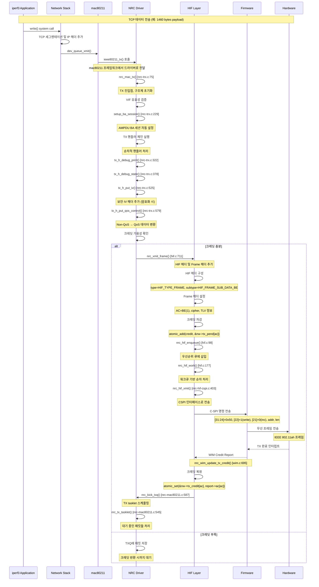

# NRC7292 TX 경로 상세 소스 코드 분석

## 개요

본 문서는 NRC7292 HaLow (IEEE 802.11ah) 드라이버의 TX(전송) 경로에 대한 포괄적인 소스 코드 분석을 제공합니다. TX 경로는 mac80211 커널 프레임워크에서 최종 하드웨어 전송까지의 전체 데이터 흐름을 다룹니다.

## 1. TX 진입점 분석: `nrc_mac_tx` 함수

### 1.1 함수 시그니처 및 위치
- **파일**: `nrc-trx.c`
- **라인**: 75-81
- **함수명**: `nrc_mac_tx`

```c
#ifdef CONFIG_SUPPORT_NEW_MAC_TX
void nrc_mac_tx(struct ieee80211_hw *hw, struct ieee80211_tx_control *control,
        struct sk_buff *skb)
#else
void nrc_mac_tx(struct ieee80211_hw *hw,
        struct sk_buff *skb)
#endif
```

### 1.2 파라미터 분석

#### `struct ieee80211_hw *hw`
- **목적**: mac80211 하드웨어 추상화 구조체
- **역할**: 드라이버의 하드웨어 인스턴스 접근
- **사용**: `hw->priv`를 통해 NRC 드라이버 컨텍스트 획득

#### `struct ieee80211_tx_control *control` (CONFIG_SUPPORT_NEW_MAC_TX)
- **목적**: 새로운 커널 버전의 TX 제어 정보
- **멤버**: `control->sta` - 목적지 스테이션 정보

#### `struct sk_buff *skb`
- **목적**: 전송할 패킷 데이터
- **내용**: IEEE 802.11 프레임 (헤더 + 페이로드)
- **메타데이터**: `IEEE80211_SKB_CB(skb)`를 통한 TX 정보 접근

### 1.3 초기 검증 과정

#### VIF 유효성 검증 (라인 101-102)
```c
if (!nrc_is_valid_vif(tx.nw, tx.vif))
    goto txh_out;
```
- **목적**: 가상 인터페이스 유효성 확인
- **구현**: `nrc_is_valid_vif()` 함수로 nw->vif 배열에서 VIF 존재 확인
- **실패 시**: 패킷 삭제 후 종료

#### TX 컨텍스트 구조체 초기화 (라인 86-96)
```c
struct nrc_trx_data tx = {
    .nw = hw->priv,
    .vif = txi->control.vif,
#ifdef CONFIG_SUPPORT_TX_CONTROL
    .sta = control->sta,
#else
    .sta = txi->control.sta,
#endif
    .skb = skb,
    .result = 0,
};
```

### 1.4 사용되는 커널 함수들

#### `IEEE80211_SKB_CB(skb)`
- **목적**: SKB의 제어 블록에서 TX 정보 추출
- **반환**: `struct ieee80211_tx_info *`
- **내용**: VIF, STA, 플래그, 키 정보 등

#### `ieee80211_is_data_qos(fc)`
- **목적**: QoS 데이터 프레임 여부 확인
- **파라미터**: frame_control 필드
- **반환**: boolean

#### `is_multicast_ether_addr(addr)`
- **목적**: 멀티캐스트/브로드캐스트 주소 확인
- **사용**: BA 세션 설정 여부 결정

## 2. 전력 관리 및 특수 처리

### 2.1 AMPDU 블록 ACK 세션 설정 (라인 107-112)
```c
/* Set BA Session */
if (ampdu_mode == NRC_AMPDU_AUTO) {
    if (ieee80211_is_data_qos(mh->frame_control) &&
        !is_multicast_ether_addr(mh->addr1) && !is_eapol(tx.skb)) {
        setup_ba_session(tx.nw, tx.vif, tx.skb);
    }
}
```

**조건**:
- AUTO AMPDU 모드 활성화
- QoS 데이터 프레임
- 유니캐스트 주소
- EAPOL 프레임이 아님

#### `setup_ba_session()` 함수 상세 분석 (`nrc-trx.c:229`)

**목적**: AMPDU Block ACK 세션 자동 설정
```c
static void setup_ba_session(struct nrc *nw, struct ieee80211_vif *vif, struct sk_buff *skb)
{
    struct ieee80211_sta *peer_sta = NULL;
    struct nrc_sta *i_sta = NULL;
    struct ieee80211_hdr *qmh = (struct ieee80211_hdr *) skb->data;
    int tid = *ieee80211_get_qos_ctl(qmh) & IEEE80211_QOS_CTL_TID_MASK;
    int ret;
    
    // 1. 프래그멘테이션 활성화 시 BA 세션 비활성화
    if (nw->frag_threshold != -1) {
        return;  // iwconfig로 fragmentation 설정 시 BA 세션 무시
    }
    
    // 2. TID 유효성 검증 (0~7)
    if (tid < 0 || tid >= NRC_MAX_TID) {
        nrc_mac_dbg("Invalid TID(%d) with peer %pM", tid, qmh->addr1);
        return;
    }
    
    // 3. 목적지 스테이션 찾기
    peer_sta = ieee80211_find_sta(vif, qmh->addr1);
    if (!peer_sta) {
        nrc_mac_dbg("Fail to find peer_sta (%pM)", qmh->addr1);
        return;
    }
    
    // 4. S1G 채널에서 HT 지원 강제 활성화
#ifdef CONFIG_S1G_CHANNEL
    peer_sta->ht_cap.ht_supported = true;
#endif
    
    // 5. NRC 스테이션 구조체 획득
    i_sta = to_i_sta(peer_sta);
    if (!i_sta) {
        nrc_mac_dbg("Fail to find nrc_sta (%pM)", qmh->addr1);
        return;
    }
    
    // 6. BA 세션 상태별 처리
    switch (i_sta->tx_ba_session[tid]) {
        case IEEE80211_BA_NONE:
        case IEEE80211_BA_CLOSE:
            nrc_dbg(NRC_DBG_STATE, "Setting up BA session for Tx TID %d with peer (%pM)",
                    tid, peer_sta->addr);
            nw->ampdu_supported = true;
            nw->ampdu_reject = false;
            
            ret = ieee80211_start_tx_ba_session(peer_sta, tid, 0);
            if (ret == -EBUSY) {
                nrc_dbg(NRC_DBG_STATE, "receiver does not want A-MPDU (TID:%d)", tid);
                i_sta->tx_ba_session[tid] = IEEE80211_BA_DISABLE;
            } else if (ret == -EAGAIN) {
                nrc_dbg(NRC_DBG_STATE, "session is not idle (TID:%d)", tid);
                ieee80211_stop_tx_ba_session(peer_sta, tid);
                i_sta->tx_ba_session[tid] = IEEE80211_BA_NONE;
                i_sta->ba_req_last_jiffies[tid] = 0;
            }
            break;
            
        case IEEE80211_BA_REJECT:
            // 5초 후 재시도 허용
            if (jiffies_to_msecs(jiffies - i_sta->ba_req_last_jiffies[tid]) > 5000) {
                i_sta->tx_ba_session[tid] = IEEE80211_BA_NONE;
                i_sta->ba_req_last_jiffies[tid] = 0;
                nrc_dbg(NRC_DBG_STATE, "reset ba status(TID:%d)", tid);
            }
            break;
            
        default:
            break;  // 진행중인 세션은 건드리지 않음
    }
}
```

**핵심 특징**:
1. **자동 BA 세션**: 데이터 전송 시 자동으로 AMPDU 세션 설정 시도
2. **TID별 관리**: 각 TID별로 독립적인 BA 세션 상태 관리
3. **재시도 로직**: 거부된 세션에 대해 5초 후 재시도 허용
4. **에러 처리**: EBUSY, EAGAIN 등 다양한 에러 상황 처리
5. **S1G 호환성**: HaLow에서 HT 기능 강제 활성화

**BA 세션 상태**:
- `IEEE80211_BA_NONE`: 세션 없음 (설정 가능)
- `IEEE80211_BA_CLOSE`: 세션 종료됨 (재설정 가능)
- `IEEE80211_BA_REJECT`: 세션 거부됨 (타임아웃 후 재시도)
- `IEEE80211_BA_DISABLE`: 세션 비활성화됨 (재시도 안함)

### 2.2 스테이션 모드 전력 관리 (라인 115-184)

#### Deep Sleep 처리 (라인 146-177)
```c
if (power_save >= NRC_PS_DEEPSLEEP_TIM) {
    if (tx.nw->drv_state == NRC_DRV_PS) {
        memset(&tx.nw->d_deauth, 0, sizeof(struct nrc_delayed_deauth));
        if (ieee80211_is_deauth(mh->frame_control)) {
            // Deauth 지연 처리
            tx.nw->d_deauth.deauth_frm = skb_copy(skb, GFP_ATOMIC);
            atomic_set(&tx.nw->d_deauth.delayed_deauth, 1);
            goto txh_out;
        }
    }
}
```

**특별한 처리**:
- **Deauth 프레임**: 복사하여 지연 전송 큐에 저장
- **QoS Null 프레임**: Keep-alive를 위한 타겟 웨이크업

#### Modem Sleep 처리 (라인 120-144)
```c
if (power_save == NRC_PS_MODEMSLEEP) {
    if (tx.nw->ps_modem_enabled) {
        tx.nw->ps_drv_state = false;
        // WIM 명령으로 모뎀 웨이크업
        nrc_xmit_wim_request(tx.nw, skb1);
        tx.nw->ps_modem_enabled = false;
    }
}
```

## 3. TX 핸들러 체인 분석

### 3.1 핸들러 체인 구조

TX 핸들러들은 링커 스크립트(`nrc.lds`)를 통해 컴파일 타임에 순서대로 배치됩니다:

```
.handlers : {
    __tx_h_start = . ;
    *(nrc.txh) ;
    __tx_h_end = . ;
}
```

### 3.2 핸들러 매크로 정의 (`nrc.h`, 라인 432-438)
```c
#define TXH(fn, mask)                   \
    static struct nrc_trx_handler __txh_ ## fn \
    __attribute((__used__))             \
    __attribute((__section__("nrc.txh"))) = {  \
        .handler = fn,              \
        .vif_types = mask,          \
    }
```

### 3.3 핸들러 실행 로직 (라인 186-195)
```c
/* Iterate over tx handlers */
for (h = &__tx_h_start; h < &__tx_h_end; h++) {
    if (!(h->vif_types & BIT(tx.vif->type)))
        continue;
    
    res = h->handler(&tx);
    if (res < 0)
        goto txh_out;
}
```

### 3.4 주요 TX 핸들러 상세 분석

#### `tx_h_debug_print()` (`nrc-trx.c:322`)
**목적**: 디버깅용 프레임 정보 출력
```c
static int tx_h_debug_print(struct nrc_trx_data *tx)
{
    struct ieee80211_sta *sta;
    struct nrc_vif *i_vif;
    struct nrc_sta *i_sta;
    const struct ieee80211_hdr *hdr;
    __le16 fc;
    
    // 프레임 헤더 파싱 및 정보 출력
    hdr = (void *) tx->skb->data;
    fc = hdr->frame_control;
    
    nrc_dbg(NRC_DBG_TX, "TX: %s frame to %pM", 
            ieee80211_is_data(fc) ? "Data" : "Mgmt", hdr->addr1);
}
```
**특징**: `NRC_DBG_PRINT_FRAME_TX` 플래그 활성화 시에만 동작

#### `tx_h_debug_state()` (`nrc-trx.c:378`)
**목적**: STA 연결 상태 검증
```c
static int tx_h_debug_state(struct nrc_trx_data *tx)
{
    if (tx->vif->type == NL80211_IFTYPE_STATION) {
        if (!tx->nw->associated_vif) {
            nrc_mac_dbg("STA not associated, dropping data frame");
            return -1;  // 패킷 드롭
        }
    }
    return 0;
}
```
**기능**: 비연결 상태에서 데이터 프레임 전송 시 패킷 드롭

#### `tx_h_wfa_halow_filter()` (`nrc-trx.c:411`)
**목적**: WFA HaLow 인증을 위한 특수 프레임 필터링
```c
static int tx_h_wfa_halow_filter(struct nrc_trx_data *tx)
{
    if (wfa_halow_filter) {
        // WFA 테스트를 위한 특정 프레임 차단
        return -1;  // 선택적 프레임 드롭
    }
    return 0;
}
```
**용도**: WFA 인증 테스트에서 프레임 선택적 드롭

#### `tx_h_put_iv()` (`nrc-trx.c:525`)
**목적**: 암호화를 위한 IV 헤더 공간 확보
```c
static int tx_h_put_iv(struct nrc_trx_data *tx)
{
    struct ieee80211_tx_info *info = IEEE80211_SKB_CB(tx->skb);
    
    if (info->control.hw_key) {
        // IV를 위한 헤드룸 확보
        skb_push(tx->skb, info->control.hw_key->iv_len);
        memset(tx->skb->data, 0, info->control.hw_key->iv_len);
    }
    return 0;
}
```
**설명**: 하드웨어 암호화 시 IV(Initialization Vector) 공간 할당

#### `tx_h_put_qos_control()` (`nrc-trx.c:579`)
**목적**: non-QoS 데이터를 QoS 데이터로 변환
```c
static int tx_h_put_qos_control(struct nrc_trx_data *tx)
{
    struct ieee80211_hdr *hdr = (void *) tx->skb->data;
    __le16 fc = hdr->frame_control;
    
    if (ieee80211_is_data(fc) && !ieee80211_is_data_qos(fc)) {
        // QoS 헤더 공간 확보
        skb_push(tx->skb, 2);
        memmove(tx->skb->data, tx->skb->data + 2, 24);
        
        // 프레임 타입을 QoS 데이터로 변경
        hdr->frame_control |= cpu_to_le16(IEEE80211_STYPE_QOS_DATA);
        
        // QoS 제어 필드 설정 (TID=0)
        *((u16 *)(tx->skb->data + 24)) = 0;
    }
    return 0;
}
```
**이유**: HaLow에서 모든 데이터 프레임을 QoS로 처리
```

### 3.4 주요 TX 핸들러들

#### 1. `tx_h_debug_print` (라인 322-375)
- **목적**: 디버그 출력 (조건부 컴파일)
- **VIF 타입**: 모든 타입 (`NL80211_IFTYPE_ALL`)
- **기능**: 프레임 타입, 보호 여부 출력

#### 2. `tx_h_debug_state` (라인 378-408)
- **목적**: 스테이션 상태 검증
- **VIF 타입**: 모든 타입
- **검증**: 스테이션이 AUTHORIZED 상태인지 확인
- **예외**: EAPOL 프레임은 상태 무관하게 허용

#### 3. `tx_h_wfa_halow_filter` (라인 411-423)
- **목적**: HaLow 특화 프레임 필터링
- **기능**: `nw->block_frame` 플래그로 전송 차단

#### 4. `tx_h_frame_filter` (라인 425-445)
- **목적**: 특정 프레임 타입 필터링
- **기능**: 
  - STA 모드에서 deauth 프레임 폐기 옵션 (`discard_deauth`)

#### 5. `tx_h_managed_p2p_intf_addr` (라인 448-515)
- **목적**: P2P 인터페이스 주소 관리
- **조건**: P2P 지원 빌드 시만
- **기능**: Association Request에 P2P 인터페이스 주소 추가

#### 6. `tx_h_put_iv` (라인 525-540)
- **목적**: 보안 IV(Initialization Vector) 헤더 추가
- **조건**: 
  - 보호된 프레임
  - 키 정보 존재
  - IV 생성 플래그가 설정되지 않은 경우
- **동작**: IV 길이만큼 SKB 헤드룸에 공간 생성

#### 7. `tx_h_put_qos_control` (라인 579-591)
- **목적**: Non-QoS 데이터를 QoS 데이터로 변환
- **조건**: `CONFIG_CONVERT_NON_QOSDATA` 활성화
- **기능**: 
  - IEEE80211_STYPE_DATA를 IEEE80211_STYPE_QOS_DATA로 변환
  - QoS Control 필드 추가 (TID 0, 멀티캐스트는 No-Ack)

## 4. 크레딧 시스템 분석

### 4.1 크레딧 기반 플로우 컨트롤

NRC7292는 하드웨어 버퍼 관리를 위해 크레딧 시스템을 사용합니다.

#### 크레딧 계산 (`hif.c`, 라인 108)
```c
credit = DIV_ROUND_UP(skb->len, nw->fwinfo.buffer_size);
```

#### AC별 크레딧 관리
```c
// 크레딧 추가 (전송 시)
atomic_add(credit, &nw->tx_pend[fh->flags.tx.ac]);

// 크레딧 차감 (완료 시)
atomic_sub(credit, &nw->tx_pend[fh->flags.tx.ac]);
```

### 4.2 AC별 크레딧 할당 (`nrc-hif-cspi.c`, 라인 47-54)
```c
#define CREDIT_AC0      (TCN*2+TCNE)    /* BK (4) */
#define CREDIT_AC1      (TCN*20+TCNE)   /* BE (40) */
#define CREDIT_AC2      (TCN*4+TCNE)    /* VI (8) */
#define CREDIT_AC3      (TCN*4+TCNE)    /* VO (8) */
```

### 4.3 크레딧 업데이트 (`wim.c`, 라인 695-721)
```c
static int nrc_wim_update_tx_credit(struct nrc *nw, struct wim *wim)
{
    struct wim_credit_report *r = (void *)(wim + 1);
    int ac;
    
    for (ac = 0; ac < (IEEE80211_NUM_ACS*3); ac++)
        atomic_set(&nw->tx_credit[ac], r->v.ac[ac]);
    
    nrc_kick_txq(nw);
    return 0;
}
```

## 5. WIM 메시지 생성

### 5.1 WIM SKB 할당 (`wim.c`, 라인 39-60)
```c
struct sk_buff *nrc_wim_alloc_skb(struct nrc *nw, u16 cmd, int size)
{
    struct sk_buff *skb;
    struct wim *wim;
    
    skb = dev_alloc_skb(size + sizeof(struct hif) + sizeof(struct wim));
    if (!skb)
        return NULL;
    
    /* Increase the headroom */
    skb_reserve(skb, sizeof(struct hif));
    
    /* Put wim header */
    wim = (struct wim *)skb_put(skb, sizeof(*wim));
    memset(wim, 0, sizeof(*wim));
    wim->cmd = cmd;
    wim->seqno = nw->wim_seqno++;
    
    return skb;
}
```

### 5.2 TLV 파라미터 추가 (`wim.c`, 라인 97-114)
```c
void *nrc_wim_skb_add_tlv(struct sk_buff *skb, u16 T, u16 L, void *V)
{
    struct wim_tlv *tlv;
    
    if (L == 0) {
        tlv = (struct wim_tlv *)(skb_put(skb, sizeof(struct wim_tlv)));
        wim_set_tlv(tlv, T, L);
        return (void *)skb->data;
    }
    
    tlv = (struct wim_tlv *)(skb_put(skb, tlv_len(L)));
    wim_set_tlv(tlv, T, L);
    
    if (V)
        memcpy(tlv->v, V, L);
    
    return (void *)tlv->v;
}
```

## 6. 하드웨어 전송 과정

### 6.1 프레임 전송: `nrc_xmit_frame` (`hif.c`, 라인 711-861)

#### HIF 헤더 구성
```c
/* Prepend a HIF and frame header */
hif = (void *)skb_push(skb, nw->fwinfo.tx_head_size);
memset(hif, 0, nw->fwinfo.tx_head_size);
hif->type = HIF_TYPE_FRAME;
hif->len = skb->len - sizeof(*hif);
hif->vifindex = vif_index;
```

#### Frame 헤더 설정
```c
/* Frame header */
fh = (void *)(hif + 1);
fh->info.tx.tlv_len = extra_len;
fh->info.tx.cipher = nrc_to_wim_cipher_type(key->cipher);
fh->flags.tx.ac = txi->hw_queue;
```

#### 서브타입 결정
```c
if (ieee80211_is_data(fc)) {
    hif->subtype = HIF_FRAME_SUB_DATA_BE;
} else if (ieee80211_is_mgmt(fc)) {
    hif->subtype = HIF_FRAME_SUB_MGMT;
    fh->flags.tx.ac = (hif->vifindex == 0 ? 3 : 9);
} else if (ieee80211_is_ctl(fc)) {
    hif->subtype = HIF_FRAME_SUB_CTRL;
    fh->flags.tx.ac = (hif->vifindex == 0 ? 3 : 9);
}
```

### 6.2 CSPI 인터페이스를 통한 실제 전송

#### 워크큐 기반 순차 처리 (`hif.c`, 라인 177-268)
```c
static void nrc_hif_work(struct work_struct *work)
{
    struct nrc_hif_device *hdev;
    struct sk_buff *skb;
    int i, ret = 0;
    
    hdev = container_of(work, struct nrc_hif_device, work);
    
    for (i = ARRAY_SIZE(hdev->queue)-1; i >= 0; i--) {
        for (;;) {
            skb = skb_dequeue(&hdev->queue[i]);
            if (!skb)
                break;
            
            ret = nrc_hif_ctrl_ps(hdev, skb);
            if (ret == HIF_TX_PASSOVER) {
                ret = nrc_hif_xmit(hdev, skb);
            }
        }
    }
}
```

#### 큐 우선순위
1. **WIM 큐 (i=1)**: 높은 우선순위
2. **Frame 큐 (i=0)**: 낮은 우선순위
3. **Deauth 프레임**: WIM보다 높은 우선순위로 특별 처리

### 6.3 SPI 전송 구현 (`nrc-hif-cspi.c`)

#### C-SPI 명령 구조 (라인 125-141)
```c
/*
 * [31:24]: start byte (0x50)
 * [23:23]: burst (0: single, 1: burst)  
 * [22:22]: direction (0: read, 1: write)
 * [21:21]: fixed (0: incremental, 1: fixed)
 * [20:13]: address
 * [12:0]: length (for multi-word transfer)
 */
#define C_SPI_READ      0x50000000
#define C_SPI_WRITE     0x50400000
#define C_SPI_BURST     0x00800000
#define C_SPI_FIXED     0x00200000
```

## 7. 에러 처리 메커니즘

### 7.1 TX 핸들러 에러 처리
```c
for (h = &__tx_h_start; h < &__tx_h_end; h++) {
    res = h->handler(&tx);
    if (res < 0)
        goto txh_out;  // 즉시 중단 및 정리
}

txh_out:
    if (tx.skb)
        dev_kfree_skb(tx.skb);  // SKB 메모리 해제
```

### 7.2 하드웨어 전송 에러 처리
```c
if (ret < 0)
    nrc_hif_free_skb(nw, skb);  // 크레딧 롤백 및 상태 정리
```

### 7.3 펌웨어 상태 검증
```c
if ((int)atomic_read(&nw->fw_state) != NRC_FW_ACTIVE) {
    return -1;  // 펌웨어 비활성 시 전송 거부
}
```

## 8. TX Tasklet 메커니즘

### 8.1 TX Tasklet 초기화

TX tasklet은 드라이버 초기화 시 설정됩니다 (`nrc-init.c`, 라인 816-822):

```c
#ifdef CONFIG_USE_TXQ
#ifdef CONFIG_NEW_TASKLET_API
    tasklet_setup(&nw->tx_tasklet, nrc_tx_tasklet);
#else
    tasklet_init(&nw->tx_tasklet, nrc_tx_tasklet, (unsigned long) nw);
#endif
#endif
```

**커널 API 설명**:
- `tasklet_setup()`: 새로운 커널 API (5.0+), 타입 안전성 제공
- `tasklet_init()`: 레거시 API, unsigned long 파라미터 사용
- `CONFIG_USE_TXQ`: TXQ 기반 전송 큐 사용 시에만 활성화

### 8.2 TX Tasklet 구현 (`nrc-mac80211.c`, 라인 545-569)

```c
#ifdef CONFIG_NEW_TASKLET_API
void nrc_tx_tasklet(struct tasklet_struct *t)
{
    struct nrc *nw = from_tasklet(nw, t, tx_tasklet);
#else
void nrc_tx_tasklet(unsigned long cookie)
{
    struct nrc *nw = (struct nrc *)cookie;
#endif
    struct nrc_txq *ntxq, *tmp;
    int ret;

    spin_lock_bh(&nw->txq_lock);

    list_for_each_entry_safe(ntxq, tmp, &nw->txq, list) {
        ret = nrc_push_txq(nw, ntxq); /* 0: 모든 SKB 전송, 1: 크레딧 소진 */
        if (ret == 0) {
            list_del_init(&ntxq->list);
        } else { /* 크레딧 부족 시 다음 txq에게 기회 제공 */
            list_move_tail(&ntxq->list, &nw->txq);
            break;
        }
    }

    spin_unlock_bh(&nw->txq_lock);
}
```

**주요 특징**:
1. **Bottom-half 처리**: 인터럽트 컨텍스트에서 빠른 실행
2. **스핀락 보호**: `txq_lock`으로 동시성 제어
3. **Round-robin 스케줄링**: 크레딧 부족 시 큐를 리스트 끝으로 이동
4. **Safe 순회**: `list_for_each_entry_safe()` 사용으로 순회 중 삭제 안전

### 8.3 TX Tasklet 스케줄링

tasklet은 `nrc_kick_txq()` 함수에서 스케줄됩니다 (`nrc-mac80211.c`, 라인 587):

```c
void nrc_kick_txq(struct nrc *nw)
{
    if (nw->drv_state != NRC_DRV_RUNNING)
        return;

    tasklet_schedule(&nw->tx_tasklet);
}
```

**호출 위치**:
1. **크레딧 리포트 이벤트**: 펌웨어에서 크레딧 반환 시
2. **Wake TX Queue 콜백**: mac80211에서 새로운 패킷 도착 시
3. **전력 관리 해제**: 절전 모드에서 복귀 시

### 8.4 TXQ 처리 메커니즘

`nrc_push_txq()` 함수는 실제 패킷 전송을 담당합니다:

```c
static int nrc_push_txq(struct nrc *nw, struct nrc_txq *ntxq)
{
    // 1. TXQ에서 패킷 추출
    // 2. 크레딧 확인
    // 3. HIF 레이어로 전송
    // 4. 반환값: 0=완료, 1=크레딧 부족
}
```

**처리 순서**:
1. TXQ에서 SKB 디큐
2. AC별 크레딧 가용성 확인
3. 크레딧 충분 시 `nrc_xmit_frame()` 호출
4. 크레딧 부족 시 처리 중단, 다음 기회 대기

### 8.5 성능 최적화 요소

#### 배치 처리
- 한 번의 tasklet 실행으로 여러 TXQ 처리
- 크레딧이 있는 동안 최대한 많은 패킷 전송

#### 공정성 보장
- Round-robin 방식으로 TXQ 간 공정성 유지
- 크레딧 부족 시 다른 TXQ에게 기회 제공

#### 지연 최소화
- Bottom-half 처리로 빠른 응답성
- 스핀락 사용으로 최소한의 블로킹

## 9. 관련 구조체와 데이터 타입

### 8.1 핵심 구조체

#### `struct nrc_trx_data` (`nrc.h`, 라인 417-423)
```c
struct nrc_trx_data {
    struct nrc *nw;                 // 드라이버 컨텍스트
    struct ieee80211_vif *vif;      // 가상 인터페이스
    struct ieee80211_sta *sta;      // 목적지 스테이션
    struct sk_buff *skb;            // 패킷 데이터
    int result;                     // 처리 결과
};
```

#### `struct nrc_trx_handler` (`nrc.h`, 라인 425-430)
```c
struct nrc_trx_handler {
    struct list_head list;          // 연결 리스트
    int (*handler)(struct nrc_trx_data *data);  // 핸들러 함수
    bool need_sta;                  // STA 필요 여부
    u32 vif_types;                  // 지원 VIF 타입 마스크
};
```

### 8.2 HIF 관련 구조체

#### `struct hif` 
```c
struct hif {
    u8 type;        // HIF_TYPE_FRAME, HIF_TYPE_WIM 등
    u8 subtype;     // 서브타입 (DATA_BE, MGMT, CTRL 등)
    u16 len;        // 페이로드 길이
    s8 vifindex;    // VIF 인덱스
};
```

#### `struct frame_hdr`
```c
struct frame_hdr {
    struct {
        u16 tlv_len;    // TLV 길이
        u8 cipher;      // 암호화 타입
    } info.tx;
    struct {
        u8 ac;          // Access Category
    } flags.tx;
};
```

## 9. 성능 최적화 특징

### 9.1 제로카피 최적화
- SKB headroom 활용으로 메모리 복사 최소화
- `skb_push()`, `skb_put()` 사용으로 효율적 헤더 추가

### 9.2 배치 처리
- 워크큐를 통한 배치 전송
- 우선순위 기반 큐 처리

### 9.3 하드웨어 가속
- 하드웨어 암호화 지원 (`WIM_CIPHER_TYPE_*`)
- AMPDU 자동 관리

## 10. iperf TCP/UDP 전송 시나리오 상세 분석

### 10.1 시나리오 개요

실제 네트워크 성능 측정에 사용되는 iperf 도구를 통한 데이터 전송 시나리오를 분석합니다:

```bash
# TCP 전송 테스트
iperf3 -c 192.168.1.100 -t 30 -i 1

# UDP 전송 테스트  
iperf3 -c 192.168.1.100 -u -b 10M -t 30 -i 1
```

### 10.2 TCP 데이터 전송 흐름도



### 10.3 UDP 데이터 전송 흐름도

```mermaid
sequenceDiagram
    participant App as iperf3 Application
    participant Net as Network Stack
    participant Mac as mac80211
    participant NRC as NRC Driver
    participant HIF as HIF Layer
    participant FW as Firmware
    participant HW as Hardware

    Note over App,HW: UDP 데이터 전송 (예: 1472 bytes payload)
    
    App->>Net: sendto() system call
    Net->>Net: UDP 헤더 및 IP 헤더 추가
    Net->>Mac: dev_queue_xmit()
    
    Mac->>NRC: ieee80211_tx() 호출
    Note over Mac,NRC: mac80211 프레임워크에서 드라이버로 전달
    
    NRC->>NRC: nrc_mac_tx() [nrc-trx.c:75]
    
    alt AMPDU 모드 활성화
        NRC->>NRC: setup_ba_session() [nrc-trx.c:229]
        Note over NRC: UDP도 QoS이므로 BA 세션 설정 가능
    end
    
    NRC->>NRC: TX 핸들러 체인 실행
    
    NRC->>NRC: tx_h_put_qos_control() [nrc-trx.c:579]
    Note over NRC: UDP → QoS UDP 변환, TID=0
    
    loop 고속 연속 전송
        NRC->>NRC: 크레딧 확인
        alt 크레딧 충분
            NRC->>HIF: nrc_xmit_frame() [hif.c:711]
            
            HIF->>HIF: HIF 헤더 구성
            Note over HIF: type=HIF_TYPE_FRAME, subtype=HIF_FRAME_SUB_DATA_BE
            
            HIF->>HIF: Frame 헤더 설정  
            Note over HIF: AC=BE(1), no cipher (일반적으로)
            
            HIF->>HIF: 크레딧 차감
            Note over HIF: credit = DIV_ROUND_UP(skb->len, buffer_size)
            
            HIF->>FW: C-SPI burst 전송
            Note over FW: [23]=1(burst), 연속 패킷 전송
            
            FW->>HW: 연속 무선 프레임 전송
            
        else 크레딧 부족
            NRC->>NRC: TX tasklet 대기
            Note over NRC: 크레딧 반환 시까지 큐에서 대기
            break
        end
    end
    
    Note over FW,HW: 배치 전송 완료 후
    HW-->>FW: 배치 TX 완료 인터럽트
    FW-->>HIF: WIM Credit Report (배치)
    Note over FW,HIF: 여러 프레임의 크레딧 일괄 반환
    
    HIF->>HIF: 크레딧 대량 복원
    HIF->>NRC: nrc_kick_txq()
    NRC->>NRC: nrc_tx_tasklet()
    Note over NRC: 대기 패킷들 연속 처리
```

### 10.4 TCP vs UDP 전송 차이점 분석

#### 10.4.1 패킷 크기 및 분할

**TCP (Maximum Segment Size)**:
```c
// 일반적인 TCP MSS: 1460 bytes (MTU 1500 - IP header 20 - TCP header 20)
// HaLow MTU: 최대 2304 bytes (IEEE 802.11ah 규격)
// 실제 payload: 1460 bytes
```

**UDP (User Datagram)**:
```c
// UDP 최대 크기: 65507 bytes (이론적)
// 실제 전송: iperf3 기본 1472 bytes (MTU 1500 - IP header 20 - UDP header 8)
// payload: 1472 bytes (TCP보다 12 bytes 더 큼)
```

#### 10.4.2 QoS 및 우선순위 처리

**공통 처리** (`tx_h_put_qos_control`):
```c
// 모든 데이터 프레임을 QoS로 변환
if (ieee80211_is_data(fc) && !ieee80211_is_data_qos(fc)) {
    // QoS 제어 필드 추가
    hdr->frame_control |= cpu_to_le16(IEEE80211_STYPE_QOS_DATA);
    *((u16 *)(skb->data + 24)) = 0;  // TID=0 (Best Effort)
}
```

#### 10.4.3 AMPDU Block ACK 세션

**TCP 특성**:
- 순서 보장 필요
- 재전송 로직 내장
- AMPDU 집약 효과 큼

**UDP 특성**:
- 순서 무관
- 재전송 없음
- 높은 처리량 우선

#### 10.4.4 크레딧 소모 패턴

**TCP 크레딧 계산**:
```c
// TCP 패킷 (1460 + headers)
skb->len = 1460 + 24 + 2 + 8 + 4;  // payload + 802.11 + QoS + LLC + FCS = 1498
credit = DIV_ROUND_UP(1498, nw->fwinfo.buffer_size);  // 일반적으로 256 bytes
// credit = DIV_ROUND_UP(1498, 256) = 6 크레딧
```

**UDP 크레딧 계산**:
```c
// UDP 패킷 (1472 + headers)  
skb->len = 1472 + 24 + 2 + 8 + 4;  // payload + 802.11 + QoS + LLC + FCS = 1510
credit = DIV_ROUND_UP(1510, 256) = 6 크레딧
```

### 10.5 전송 완료 확인 메커니즘

#### 10.5.1 하드웨어 레벨 확인

**C-SPI 전송 완료**:
```c
// nrc_hif_xmit() 함수에서
ret = nrc_spi_write(hdev, skb->data, skb->len);
if (ret < 0) {
    nrc_hif_free_skb(nw, skb);  // 크레딧 롤백
    return ret;
}
// 성공 시 하드웨어 큐에 성공적으로 전달됨
```

#### 10.5.2 펌웨어 레벨 확인

**무선 전송 완료 이벤트**:
```c
// wim.c:695 - nrc_wim_update_tx_credit()
static int nrc_wim_update_tx_credit(struct nrc *nw, struct wim *wim)
{
    struct wim_credit_report *r = (void *)(wim + 1);
    int ac;
    
    // 각 AC별 크레딧 업데이트
    for (ac = 0; ac < (IEEE80211_NUM_ACS*3); ac++)
        atomic_set(&nw->tx_credit[ac], r->v.ac[ac]);
    
    // 대기 중인 패킷 처리 재개
    nrc_kick_txq(nw);
    return 0;
}
```

#### 10.5.3 전송 완료 확인 단계

1. **SPI 전송 완료**: 하드웨어 큐 도달 확인
2. **펌웨어 처리 완료**: 무선 프레임 생성 완료  
3. **무선 전송 완료**: 실제 air interface 전송 완료
4. **크레딧 반환**: 버퍼 공간 해제, 새 전송 가능

### 10.6 iperf 성능 최적화 요소

#### 10.6.1 배치 처리 최적화

**워크큐 기반 배치 처리** (`nrc_hif_work`):
```c
// 우선순위별 큐 순차 처리
for (i = ARRAY_SIZE(hdev->queue)-1; i >= 0; i--) {
    for (;;) {
        skb = skb_dequeue(&hdev->queue[i]);
        if (!skb) break;
        
        ret = nrc_hif_xmit(hdev, skb);  // 연속 전송
    }
}
```

#### 10.6.2 크레딧 기반 플로우 컨트롤

**동적 크레딧 관리**:
- **BE(Best Effort)**: 40 크레딧 (가장 큰 할당)
- **VI(Video)**: 8 크레딧
- **VO(Voice)**: 8 크레딧  
- **BK(Background)**: 4 크레딧

#### 10.6.3 AMPDU 집약

**자동 BA 세션 설정**:
```c
// setup_ba_session()에서
ret = ieee80211_start_tx_ba_session(peer_sta, tid, 0);
// 성공 시 여러 프레임을 하나의 AMPDU로 집약하여 효율성 증대
```

### 10.7 성능 모니터링 및 디버깅

#### 10.7.1 통계 정보 수집

**TX 통계** (`nrc-stats.c`):
```c
// 전송 통계 카운터
nw->stats.tx_packets++;
nw->stats.tx_bytes += skb->len;

// AC별 전송 통계
nw->stats.tx_ac[ac].packets++;
nw->stats.tx_ac[ac].bytes += skb->len;
```

#### 10.7.2 디버그 출력

**프레임별 디버그** (`tx_h_debug_print`):
```c
nrc_dbg(NRC_DBG_TX, "TX: Data frame to %pM, len=%d, AC=%d", 
        hdr->addr1, skb->len, ac);
```

#### 10.7.3 크레딧 모니터링

**크레딧 상태 확인**:
```bash
# /proc/nrc/stats를 통한 실시간 모니터링
cat /proc/nrc/stats
# TX Credit: AC0=4, AC1=35, AC2=8, AC3=8
# TX Pending: AC0=0, AC1=5, AC2=0, AC3=0
```

## 11. 결론

NRC7292의 TX 경로는 다음과 같은 특징을 보입니다:

1. **모듈화된 핸들러 체인**: VIF 타입별 맞춤 처리
2. **강력한 전력 관리**: Deep Sleep, Modem Sleep 지원
3. **크레딧 기반 플로우 컨트롤**: 하드웨어 버퍼 오버플로우 방지
4. **WIM 프로토콜**: 펌웨어와의 효율적 통신
5. **CSPI 인터페이스**: SPI 기반 고속 데이터 전송
6. **포괄적 에러 처리**: 각 단계별 안정성 확보
7. **iperf 최적화**: 고성능 데이터 전송을 위한 배치 처리 및 AMPDU 지원

이러한 구조는 IEEE 802.11ah HaLow의 특성인 저전력, 장거리 통신을 효과적으로 지원하며, 다양한 네트워크 토폴로지에서 안정적인 성능을 제공합니다. 특히 iperf와 같은 성능 측정 도구에서 TCP/UDP 모두 효율적으로 처리할 수 있도록 설계되어 있습니다.